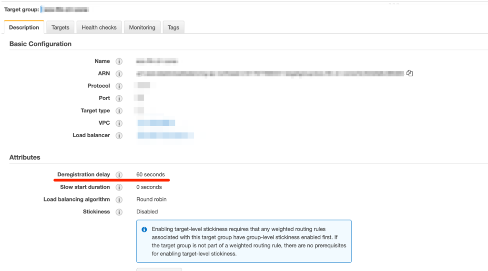

최근 ECS를 도입하면서 Rolling Deploy 를 적용했다. 이전에는 EC2인스턴스마다 방문하면서 배포를 했다면 이제는 새로운 Fargate기반 태스크가 생성되면서 기존 태스크는 없애는 방식으로 배포된다.

테스트를 진행하다보니 ALB Target Group에 등록된 아이템이 Draining에 걸리는 시간이 긴 것이 눈에 들어왔다. 기본값으로 이 값은 300초가 주어지기 때문에 트래픽이 많지 않거나 커넥션을 오래 유지할 필요가 없다면 이 시간만큼 Fargate인스턴스를 더 사용하는 셈이다.

타겟그룹의 Draining에 걸리는 시간은 “Deregistration delay”항목에서 수정할 수 있다.

<figure></figure>

> 참고: https://docs.aws.amazon.com/elasticloadbalancing/latest/application/load-balancer-target-groups.html#deregistration-delay
