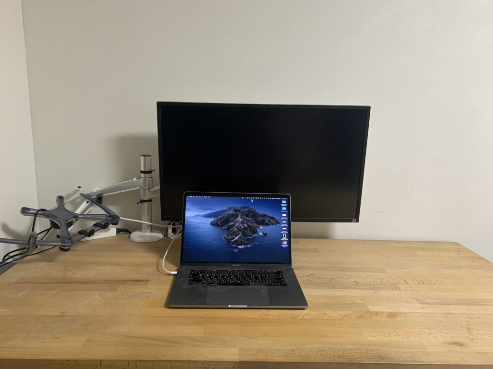
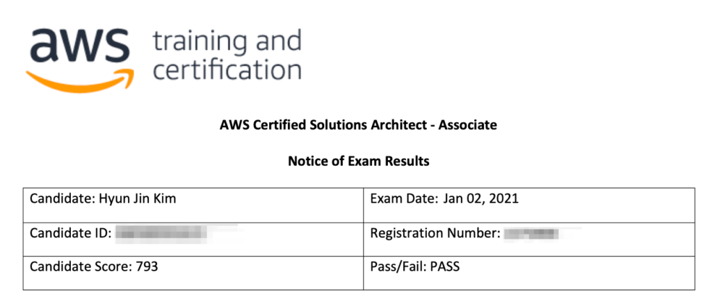
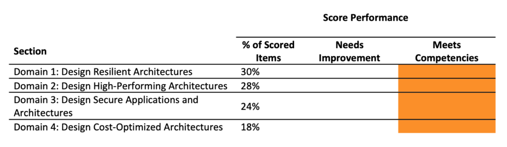
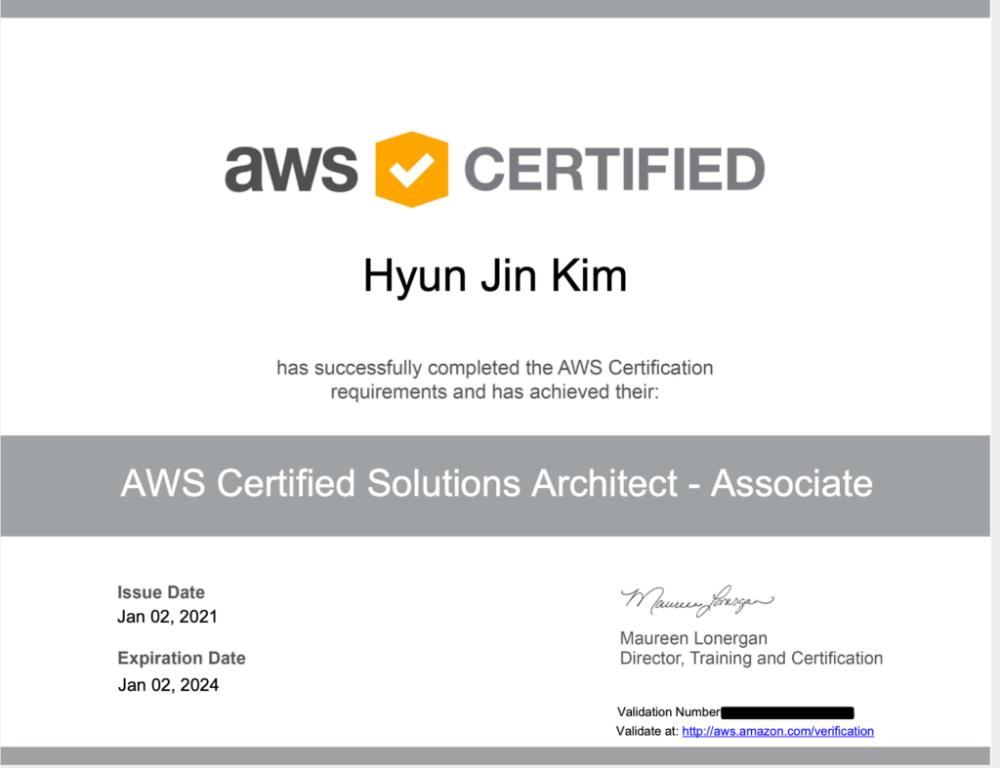

꾸준히 AWS관련 업무를 맡아왔다. 업무로 다뤄 본 영역은 잘 알지만 다른 영역들은 전혀 모르는 부분들이 많았다. 매뉴얼을 읽을 때마다 전체를 조망하는데 어려움을 느꼈고 한번쯤은 몰입해 살펴봐야겠다고 생각해왔다.

2020년 11월 쯤 되니 한 해가 가는 것에 대한 조바심이 들었다. 가시적인, 스스로를 위한 성과가 필요하다고 생각했다. 그래서 미뤄뒀던 AWS SAA자격 취득을 준비했다.

학습자료
----

우선 예전 할인 때 사놓은 Udemy의 관련강의를 들었다. 다만 PPT를 읽는 수준에 그쳤기 때문에 만족도는 생각보다 크지 않았다. 대신 AWS SAA-C02 Study Guide라는 Github리포를 프린트해서 자주 읽었다. 이 요약본보다 더 깊은 공부가 필요한 경우는 AWS 공식 블로그와 매뉴얼, 예전에 받아놓은 AWS 관련 EBook을 함께 읽었다.

-   스터디가이드 [https://github.com/keenanromain/AWS-SAA-C02-Study-Guide](https://github.com/keenanromain/AWS-SAA-C02-Study-Guide)
-   Udemy SAA-C02 (A CloudGuru 창업자, 변호사가 AWS Community Hero가 된 스토리가 인상적이다.) [https://www.udemy.com/share/101WaCAEQdc1pSQ3g=/](https://www.udemy.com/share/101WaCAEQdc1pSQ3g=/)
-   AWS블로그 [https://aws.amazon.com/blogs/aws/](https://aws.amazon.com/blogs/aws/)
-   EBook [https://www.packtpub.com/product/aws-certified-solutions-architect-associate-guide/9781789130669](https://www.packtpub.com/product/aws-certified-solutions-architect-associate-guide/9781789130669)

시험
--

2021년 1월 2일에 시험을 봤다. 사실 2020년을 마무리하면서 보려고 했는데 정리가 좀 덜되어서 연초로 옮겨 본 것이었다. 주로 영어자료를 참고했기 때문에 시험은 영어로 쳤다.

시험은 비대면으로 진행했다. 내 방에서 진행하는 비대면 시험은 처음이어서 이런 저런 절차를 처리하는데 시간이 걸렸다. 우선 책상의 모든 물건을 치워야 했다. 덕분에 새해맞이 책상정리를 하게 됐다. 또 감독관과 영어로 채팅을 하는 것은 예상하지 못해서 좀 당황했다. 신원확인은 여권을 카메라에 보는 방식으로 진행했고 책상위의 “모든” 물건은 바닥으로 옮겼다. 방이 좀 지저분했는데 노트북을 들고 방의 모든 구석구석을 보여줘야 해서 부끄러웠다. 또 예상치 못한 잡음을 방지하기 위해 창문을 닫았다. 긴장 때문에 시험 전부터 식은 땀이 났다.

<figure><ul class="blocks-gallery-grid"><li class="blocks-gallery-item"><figure></figure></li></ul></figure>

시험문제는 어려웠다. 실은 공부가 많이 모자란 탓 이었다. 푸는 도중에 ‘떨어질 수도 있겠다’ 생각을 두어번 했다. 역시나 점수는 그다지 만족스럽지 않았다.

결과
--

793/720 으로 합격했다. 크게 더 떨어지는 부분은 없이 전체적으로 못본 것..으로 나왔다.

<figure></figure>

<figure></figure>

<figure></figure>

회고
--

영어가 어려웠다기 보다는 시나리오 위주의 문제를 풀기에 스터디 가이드를 외우는 것으로는 부족했다고 생각한다. 대신 AWS공식블로그의 사례연구가 큰 도움이 되었다. 비슷하지만 조금 다른 특성들에 대해서는 차이점에 대해 정확하게 아는 것이 중요하고 이게 문제로는 어떻게 나올지 상상해보는 것이 좋겠다는 생각이 들었다.

사용하지 못한 기술들이 있기 때문에 다시 공부하지 않으면 잊혀지기 쉬울 듯 하다. 다음 단계의 시험을 조만간 준비해야 공부가 수월할 것 같다.
