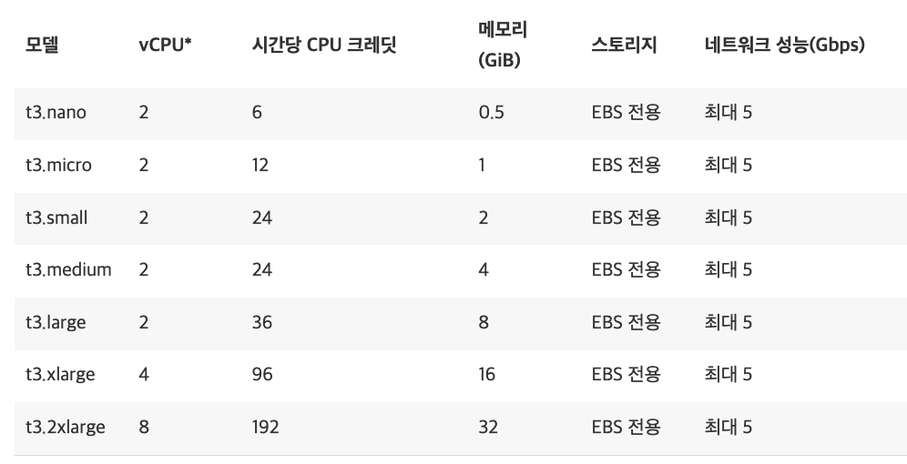
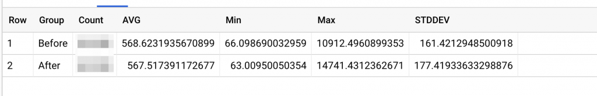
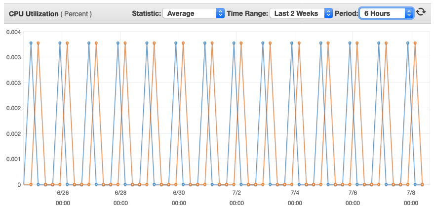

AWS의 Private Subnet에 있는 인스턴스가 외부와 통신하려면 NAT를 활용해야한다. 그렇다면 NAT인스턴스를 만들어 사용할지, NAT 게이트웨이(Gateway, 이하 GW)를 사용할지 결정해야 한다.

> [AWS VPC 와 서브넷](https://elegantcoder.com/aws-vpc-%ec%99%80-%ec%84%9c%eb%b8%8c%eb%84%b7/)

VPC의 NAT Gateway 가격은 서울리전에서 $0.059 이다. 1달이 월 720시간이라면 Multiple AZ를 고려해 2개를 설치하면 월 $84.96, 약 10만원의 추가부담이 생긴다.

NAT Instance로 구성한다면 EC2 1년 선결제 없는 경우의 예약 인스턴스 사용시 c5.large, m5.large, t3.large 정도의 가격이다.

NAT GW는 기본 5Gbps의 대역폭을 지원하고 45Gbps까지 확장가능하다. 또 관리 소요가 줄어들기 때문에 AWS에서는 GW를 활용할 것을 권고하고 있다. 하지만 이런 수치는 트래픽에 따라 달라질 것이라 우리 회사의 경우 가격 부담없이 사용할 수 있을지 확인해보고 싶었다. 특히 t3.nano를 적용했을 때의 성능이 활용할만한지 궁금했다. AWS홈페이지에 나와있듯 t3.nano의 네트워크 대역폭은 최대 5Gbps 이다.

참고:  
[AWS, NAT 인스턴스 및 NAT 게이트웨이 비교](https://docs.aws.amazon.com/ko_kr/vpc/latest/userguide/vpc-nat-comparison.html)  
[AWS, Amazon EC2 인스턴스 유형](https://aws.amazon.com/ko/ec2/instance-types/)

적용방법
----

먼저 Public 서브넷의 호스트를 Private으로 옮긴 후 t3.nano 로 만든 NAT인스턴스를 각 AZ의 Public Subnet에 설치했다. 인스턴스의 AMI는 AWS 매뉴얼([참고: AWS, NAT인스턴스](https://docs.aws.amazon.com/ko_kr/vpc/latest/userguide/VPC_NAT_Instance.html))에 설명된 대로 AWS에서 제공하는 AMI를 사용했다.

### NAT 인스턴스 전송속도

아래 수치들은 백엔드끼리 연결된 타사와의 트래픽이다(서비스 트래픽은 로드밸런서에 연결되어있다). 제휴사와의 트래픽 중 HTTPS 단일 호스트에 200 OK 로 제한한 결과다.  
결론부터 말하자면 현재 우리 트래픽으로는 t3.nano NAT인스턴스 사용시에도 큰 차이가 나지 않았다. 특히 T3계열 네트워크 속도가 “최대5Gbps” 이고 경험상 때때로 네트워크가 지연되는 경우도 자주 봤지만(소위 튕기는 현상), 이번에는 편차면에서도 크게 차이가 없음을 확인할 수 있었다.

참고)

-   Group: Before / After – 적용 전후
-   Count : 요청 및 응답수 (50만건 전후)
-   AVG: 평균 (ms 단위)
-   Min: 최소값(ms 단위)
-   Max: 최대값(ms 단위)
-   STDDEV: 표준편차(ms 단위)

### NAT 인스턴스 리소스 사용률

AWS의 T계열은 CPU사용률을 고려해야한다. 하지만 현재로써는 설치된 NAT인스턴스의 CPU사용률이 높지 않아 만약 더 저렴한 인스턴스 타입이 나온다면 전환하는 것도 가능할 것으로 보인다.

마지막으로 비용은 t3.nano, 표준 1년 선결제 예약인스턴스, GP 8GB EBS 를 사용해 인스턴스 대당 월 $3.5가량, 2대에 $7로 NAT GW의 $84.96에 비해 크게 비용을 아껴 구성할 수 있었다.

트래픽의 크기에 따라 다르겠으나 t3.nano 로 현재 트래픽에 대응되는 것을 확인했다. 비용면에서도 훨씬 저렴하기 때문에 소규모 스타트업이라면 적용해 보는 것을 추천한다.
