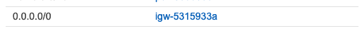

AWS 의 VPC는 리전 내에 위치하고 서브넷은 AZ내에 위치한다.

한 VPC에 AZ에 대해 여러 서브넷을 둬서 고가용성(HA)를 확보할 수 있다.

서브넷의 통신 방법은 VPC의 라우팅 규칙(Route Tables)을 따른다.

라우팅 규칙은 아이피 대역(CIDR)에 따라 타깃을 설정할 수 있고, 서브넷에 붙이는(associate) 방식으로 서브넷의 통신 방법을 설정할 수 있다. 서브넷과 라우팅 규칙은 1:n 관계이다. 각 서브넷은 한개의 라우팅 규칙을 붙일 수 있고 한 라우팅 규칙은 여러 서브넷에 적용될 수 있다.

이 라우팅 규칙을 통해 VPC Peering이나 Public Subnet, Private Subnet의 설정을 할 수 있게 된다.

인터넷 게이트웨이(IGW) / Public Subnet / Private Subnet
-----------------------------------------------

IGW는 VPC와 인터넷을 이어주는 가상 게이트웨이이다.

라우팅 규칙을 통해 IGW에 연결된 서브넷은 Public Subnet, 그렇지 않은 서브넷은 Private Subnet이라 한다.

Private Subnet 내의 인스턴스들은 Public IP를 갖지 않고 인터넷에 직접 노출되어있지 않다. Private Subnet에서 인터넷에 아이피가 노출되지 않으면서 인터넷에 접속하려면 NAT를 사용해야 한다.