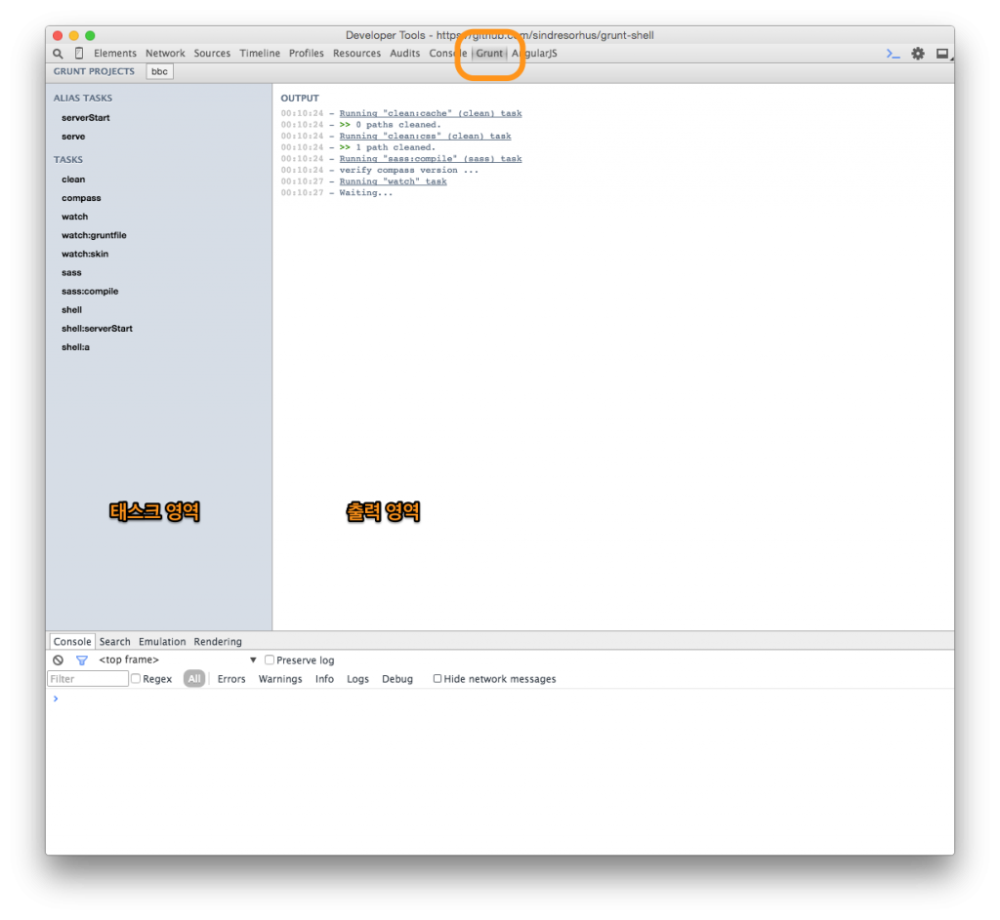
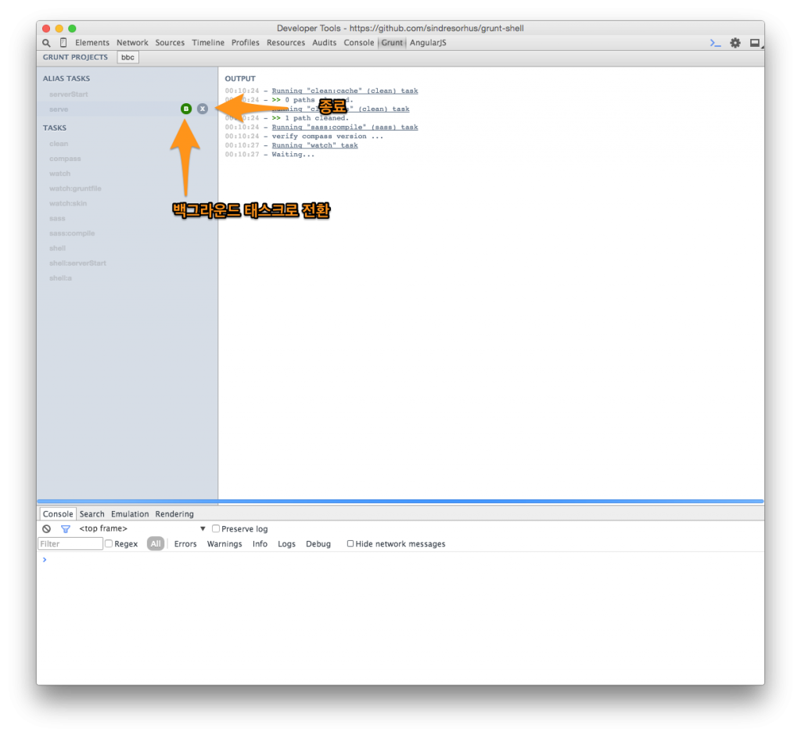

[KStyleTrip](http://kstyletrip.com) 에서는 프론트엔드 영역에서 디자이너와 개발자가 협업하고 있다.

나는 사실 HTML CSS 를 어느 수준으로 다루기는 하지만 퍼블리셔는 아니어서 픽셀 단위의 디테일을 구현하는데는 어려움이 있다. 디자이너는 디자이너 대로 원하는 만큼의 디테일을 구현하기 어려워하는 내 모습을 보기 안타까워 했다. 그래서 현실적인 수준에서 협업을 시작했다.

개발자가 디자인을 보고 큰 덩이에 대해 마크업과 CSS 처리를 하면 디자이너가 원하는 수준의 디테일을 구현하는 방식이다.

그런데 역시 개발자와 비 개발자간의 협업은 환경구성에 어려움이 있기 마련이다. 예를들어 서버를 띄우거나 하는 일들 말이다. 물론 이것도 쉘 스크립트 등을 사용해 할 수 있는 한 단순하게 만들어 관리하고 있었지만 더 쉬운 방법을 찾게 되었다.

바로 크롬 개발자도구에서 Grunt 를 사용하는 것이다. 쉘스크립트로 관리되던 작업들을 Gruntfile 에 통합하고 grunt-devtools 를 사용해 여러 작업들을 GUI 로 작동할 수 있게 만들었다.

설치과정과 실행방법을 공유하고자 한다.

설치
--

크롬 익스텐션과 grunt-devtools npm 패키지를 설치해야 한다.

### 크롬 익스텐션 설치

크롬 익스텐션은 크롬 웹스토어에서 설치할 수 있다. [바로가기](https://chrome.google.com/webstore/detail/grunt-devtools/fbiodiodggnlakggeeckkjccjhhjndnb)

익스텐션을 설치하고 크롬 개발자도구를 열어보면 Grunt 탭이 추가된 것을 알 수 있다.

[](http://elegantcoder.com/wp-content/uploads/2015/06/abstract.png)

### grunt-devtools 명령어 설치

명령어를 실행할 것이므로 -g 옵션을 주어 패키지를 설치한다.

```
$ npm install -g grunt-devtools
```

사용방법
----

Gruntfile 이 있는 경로에서 grunt-devtools 를 실행하고 개발자 도구의 gruntjs 탭으로 이동하면 프로젝트가 추가된다.

```
$ grunt-devtools
```

여러 디렉토리를 옮겨가며 추가하면 상단 프로젝트 바에 여러 프로젝트들이 추가된다. 이 프로젝트들은 일시적인 것으로, grunt-devtools 와 크롬을 종료하면 사라진다. 따라서 크롬을 다시 시작하면 프로젝트마다 다시 실행해줘야 한다.

그리고 왼편에 위치한 태스크 리스트 아이템을 더블클릭하면 태스크가 실행된다.

태스크에는 Background Tasks, Alias Tasks, Tasks 가 있다.

Alias Tasks 나 Tasks 는 Grunt 의 기본기능이다. Background Tasks 가 생소한데, 간단히 말하면 콘솔을 점유하는 watch 같은 태스크를 Background 로 실행시킬 수 있는 기능이다. 콘솔을 점유하는 태스크들은 종료하지 않으면 다른 태스크를 사용할 수 없다. 이럴 때 Background Tasks 로 실행시켜두면 실행을 종료하지 않고 다른 태스크를 동시에 실행할 수 있다.

태스크를 일단 실행시키고 그 위에 B 아이콘을 클릭하면 Background Tasks 로 실행된다.

[](http://elegantcoder.com/wp-content/uploads/2015/06/background-task.png)

이제 디자이너는 grunt-devtools 라는 명령 하나만 외우면, 혹은 단축 아이콘을 더블클릭하는 것으로 서버를 띄우고 스프라이트 아이콘을 빌드하는 등의 작업을 할 수 있게 되었다. 더 쉽게 더 많은 권한을 드릴 수 있게 되어 기분이 매우 좋다 🙂

P.S. Gulp 에도 gulp-devtools 라는 프로그램이 있다.

페이스북에 [Gruntjs 관심그룹](https://www.facebook.com/groups/gruntjs.kr/)을 운영 중입니다. 가입을 언제나 환영합니다 😀
