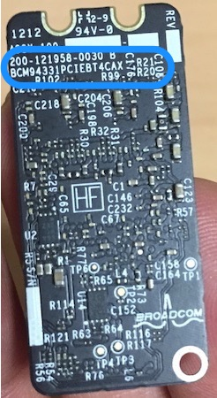
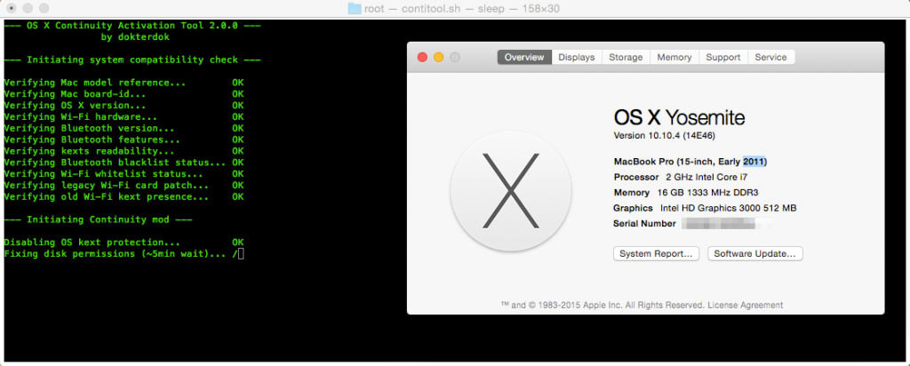
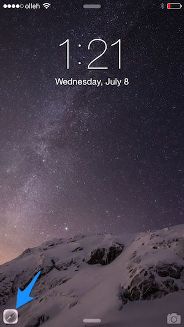
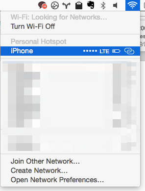

OSX Yosemite(v10.10) 이 되면서 혁신적이었다고 평가받는 것은 바로 [연속성 기능](https://www.apple.com/kr/osx/continuity/) 이다. 이 기능은 맥과 iOS 를 오가며 실행하던 애플리케이션을 끊김없이 실행할 수 있는 기능이다.

현재 가지고 있는 맥북은 Macbook Pro 15” 2011 Early CTO 버전이다. 물론 이미 노쇠했지만 개인적인 사정으로 은퇴하지 못하고 꾸준히 부품을 교체하며 버티고 있다.

하지만 현재 가지고 있는 모델이 연속성 기능이 제대로 지원되지 않아 아쉬웠다. 연속성기능에 포함된 모든 기능을 사용하기 위해서는 iOS 와 맥 모두 블루투스LE(BLE, Bluetooth Low Energy) 가 반드시 지원되어야 한다.

> 페이스타임을 통한 셀룰러 통화나 SMS 문자 전달은 동일한 아이클라우드 계정에 접속하기만 하면 자동으로 활성화되지만, iOS와 OS X간의 핸드오프와 인스턴트 핫스팟, 에어드롭 기능은 블루투스LE를 반드시 지원해야 합니다 .  
> [OS X 요세미티와 iOS 연속성 기능을 구형 맥에서 사용하는 방법… ‘2011 맥북 에어 및 맥 미니는 더 간단합니다.’ – Back To The Mac](http://macnews.tistory.com/2702)

근래에 여유가 있던 차에 맥북에서도 연속성기능을 사용할 수 있도록 부품을 교체했다.

랩탑에 탑재된 랜카드는 BCM94331PCIEBT4AX (Bluethooth 2.1+EDR) 모델인데 BLE 를 사용하기 위해서는 BCM94331PCIEBT4CAX(Bluetooth 4.0) 로 랜카드를 교체해야 한다. (모델명 끝에서 3번째에 C 에 유의.)

Back To the mac 에 따르면 이 기능을 위해 USB 블루투스 동글을 사용해도 된다고 한다[http://macnews.tistory.com/2895](http://macnews.tistory.com/2895). 하지만 USB 포트에 꽂아놓는 것은 거추장스러워 내장된 랜카드를 교체하는 방법을 선택했다. BLE 를 사용하는데 랜카드를 교체하는 이유는 랜카드에 블루투스 모듈이 탑재되어 있기 때문이다.

> 최근 패치에서 블루투스 동글 사용이 막혔다고 하니 참고 바란다.

구매
--

우선 알리익스프레스에서 랜카드를 구매했다. [http://www.aliexpress.com/snapshot/6751075037.html?orderId=68001485756049](http://www.aliexpress.com/snapshot/6751075037.html?orderId=68001485756049) 거의 가장 저렴하게 구할 수 있어서 아낀 비용을 EMS배송료에 사용했다. EMS 배송은 물론 로켓 배송이었다. 일요일에 구매한 제품이 수요일에 왔다 🙂

하드웨어 교체
-------

교체 순서는 ifixit 의 내용을 따라했다.[MacBook Pro 15″ Unibody Early 2011 AirPort/Bluetooth Board Replacement](https://www.ifixit.com/Guide/MacBook+Pro+15-Inch+Unibody+Early+2011+AirPort-Bluetooth+Board+Replacement/5886) 안테나 4군데와 메인보드와의 연결을 떼어내면 쉽게 분리할 수 있다.

분리와 재조립은 크게 어렵지 않은데 이슈가 되는 부분은 절연테이프와 안테나 연결이다. 혼선 방지를 위해 붙여진 절연테이프가 너무 얇아 한번 떼어내면 다시 붙이기 어렵다. 그래서 지금 한 면은 절연테이프가 붙어있지 않은 상태다. 절연테이프를 구하면 다시 한번 열어 붙일 예정이다. 그리고 안테나를 떼었다 붙일 때 각이 정확하게 맞아야만 다시 연결할 수 있다.

패치 적용
-----

정식지원되지 않는 기기에서 연속성 기능을 사용하려면 별도의 패치가 필요하다.패치는 [Continuity Activation Tool](http://dokterdok.github.io/Continuity-Activation-Tool/) 에서 다운받아 Back To The Mac 을 참고해 손쉽게 처리할 수 있었다. [OS X 요세미티의 연속성 기능을 구형 맥에서 쓰는 가장 간단한 방법… 블루투스 4.0 동글!](http://macnews.tistory.com/2895)

아래 스크린샷은 하드웨어 설치 직후 호환성 검사를 실행하고 있는 모습이다. 모든 것이 순조롭게 진행되었다.

활용
--

모든 것이 매우 잘 동작한다. 그리고 연속성 기능을 사용하기 시작하면서 맥라이프가 굉장히 윤택해졌다.

-   Airdrop 을 통하면 iPhone 과 iPad, 그리고 맥북에서 서로 사진과 링크도 주고 받을 수도 있다.
-   사파리 뿐 아니라 페이스북에서 외부 링크를 열어보던 페이지도 Dock 에 올라온다. (확실하진 않지만) UIWebview 를 사용하는 앱들도 연속성 기능을 사용할 수 있도록 API 가 열려있는 것으로 보인다.
-   Pocket 등 연속성 지원 앱들을 사용했을 때 자동으로 이어진다.
-   OSX 의 Wifi 메뉴에서 곧바로 개인용핫스팟(Personal Hotspot) 을 사용할 수 있다.
-   그 중에서도 링크들을 주고 받게 되면서 잠시 짬날 때 살펴보던 링크를 그대로 맥으로 이전해 볼 수 있게 된 점이 특히 마음에 든다.

참고:

-   [Continuity Activation Tool](http://dokterdok.github.io/Continuity-Activation-Tool/)
-   [요세미티와 iOS 연속성(Continuity) 기능 정리](http://bugbear5.tumblr.com/post/100737580446/ios-continuity)
-   [OS X 요세미티의 연속성 기능을 구형 맥에서 쓰는 가장 간단한 방법… 블루투스 4.0 동글!](http://macnews.tistory.com/2895)
-   [Complete guide to Continuity between Mac and iOS: Everything you need to know about Handoff, Phone Calls, Text Messages, and Instant Hotspot](http://www.macworld.co.uk/feature/mac/continuity-in-ios-8-os-x-yosemite-handoff-phone-call-text-airdrop-3524705/)
-   [How to use Continuity for iPhone, iPad, and Mac: The ultimate guide](http://www.imore.com/how-use-continuity-iphone-ipad-and-mac-ultimate-guide)