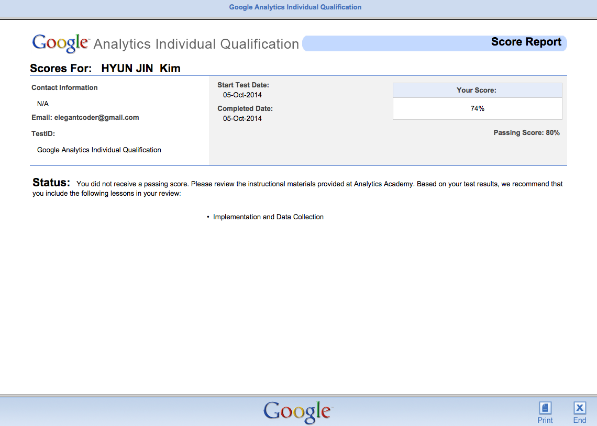
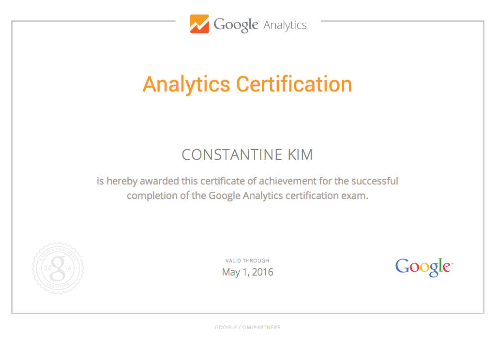

스타트업에 있다보니 지표 측정이 중요하다. 아무래도 경력이 있다보니 어깨너머로 들은 지식들은 있지만 지표측정에 대해 정확히 안다고 이야기할 수는 없었다. 그렇다고 요즘 유행하는 강의를 듣기에는 비용부담이 만만하지 않았다.

GA 강사들의 프로필을 보다보니 Google 애널리틱스 공인 전문가 자격증(GAIQ)이 빠지지 않는다는 것을 알게 되었다. 아직은 회사규모가 지표만 분석하는 사람을 뽑기에는 어려움이 있어서 내가 공부하고 적용해보기로 마음먹었다.

그렇지 않아도 GA 와는 인연이 있다. 예전 KTH 에 입사해 처음 작업한 일이 바로 이벤트 측정 코드를 곳곳에 심는 일이었다. 그렇게 대략 200개 정도의 이벤트 코드를 꽂았다. 그런 이유로 GA SDK 레퍼런스도 꽤 여러번 봤었다.

시험 준비는 구글의 가이드 대로 Google Analytics Academy 의 [Digital Analytics Fundamentals](https://analyticsacademy.withgoogle.com/course01) 강의를 보았다. (개편 후에 [Google Analytics Platform Principles](https://analyticsacademy.withgoogle.com/course02) 까지 포함되었다고 알고 있다. )그리고 [“구글 애널리틱스” 책](http://www.aladin.co.kr/shop/wproduct.aspx?ISBN=8960774146)을 한 번 다 읽었다. 강의는 영어로 되어 있지만 PDF 파일이 지원되고, 자막을 켜고 보아서 많은 도움이 되었다.

처음부터 끝까지 3번 정도 영상을 봤는데 주로 웹분석의 프로세스와 구글 애널리틱스의 기초적인 사용법에 대해 강의한다. 더 자세한 특색에 대해서는 구글 애널리틱스 도움말을 한 번 살펴본 것이 더 좋았다.

마침 사이트 런칭 직전이라 야근이 꽤 많았기 때문에 주말에만 시간이 조금 나서 대략 2개월정도 소요되었다. 동영상을 두번 보고 나서 구글의 테스트 센터에 가서 50달러를 결제하고 영어로 시험을 쳤다.

첫 시험은 사실 간만 본다는 마음으로 쳤다. 오픈북이 가능하지만 시험범위 등을 알아보는게 목적이어서 열어보지 않고 테스트를 봤고 예상대로 떨어졌다. 구글 애널리틱스의 도움말을 자세히 살펴봐야 한다는 것을 알게 됐다.

점수는 예상보다는 나쁘지 않았다. 70문제 80% 통과인데 74%로 아쉽게 탈락했다. 재시험은 2주 후에 가능했기 때문에 그 때까지 공부를 더 해야겠다고 생각했다. 

어찌어찌 시간이 지나고 2주가 지났는데 짬이 안돼 1달만에 시험을 봤다.

그런데 구글 애널리틱스 시험이 기존 테스트센터에서 사라져서 당황했다. 아직 재시험을 볼 수 없게 된 것인지 싶었다. 그래서 다른 개인 계정으로 시험센터에 재접속해보니 그냥 시험이 테스트 센터에서 사라진 것이었다.

이제 GAIQ 시험 방식이 변경되어서 이제 시험을 무료로 볼 수 있다. 시험은 [http://partners.google.com](http://partners.google.com) 에서 볼 수 있으며 이제는 한글 시험도 제공된다.

재시험을 준비하면서 이전에 공부했던 내용에 비해 조금씩 추가된 내용이 있는 것 같다는 느낌을 받았는데 아마도 이번 개편과 관련된 것으로 보인다. 물론 문제도 처음 시험볼 때 봤던 문제들이 많이 출제되었지만 못 풀어서 기억에 남았던 문제중 하나는 사라졌고, 처음보는 문제들도 추가되는 등 조금 달라졌다. 무엇보다 무료로 풀린게 속이 쓰렸다.

그리고 결과는 92% 합격이었다.  시험을 보다보니 영어로 공부한 내용을 한글로 시험을 보려니 용어 등에서 어려움이 있었다. 강의자료들이 영어로 되어 있으니 되도록 그냥 영어로 시험을 보는 것을 추천한다.

이제 기본준비는 다 되었다. 하지만 이제야 대략 틀을 잡은 것 뿐이고 공부할 것이 무척 많다는 것도 알게 되었다. 웹분석은 전문분야는 아니어서 한계는 있겠지만 조금 더 관심을 가지고 알아보려고 한다.