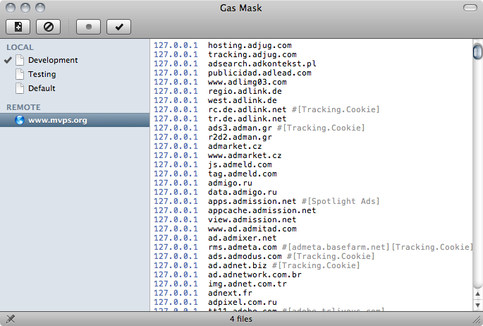

프론트엔드 작업에서는 hosts 파일을 다루어야 하는 일이 많은데요, 관리하는 프로젝트가 많아질 수록 복잡해지기 마련입니다.

그동안 Terminal 에서 vi 를 통해 hosts 파일을 관리했었습니다. 조금 더 쉽게 관리하는 방법이 없을지 살펴보다 Gas Mask 라는 프로그램을 알게 되었습니다. Gas Mask 는 OSX 에서 hosts 파일을 쉽게 관리하도록 도와주는 어플리케이션 입니다.

주요기능은

-   Syntax Highlight 를 지원하는 에디터
-   외부에 hosts 파일을 두면 자동 업데이트 가능
-   전역 단축키 지원

등 입니다.

가장 큰 특징은 hosts 파일을 여러 개 두고 전환해가며 사용할 수 있다는 점입니다. 개발 – 테스트 – 스테이징 – 실서버에 이르기까지 각 개발 단계마다 hosts 파일이 변경되어야 하는 경우를 편리하게 관리할 수 있습니다.

당장 한번 사용해보세요.

[http://www.clockwise.ee/gasmask/](http://www.clockwise.ee/gasmask/)