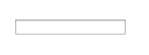
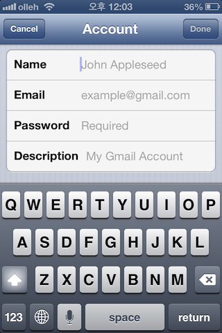
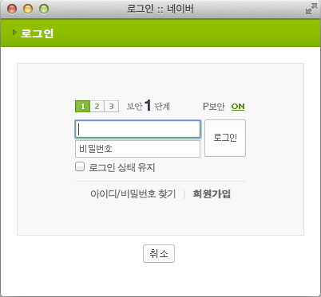
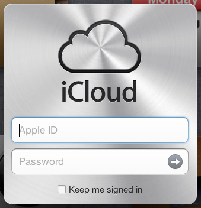
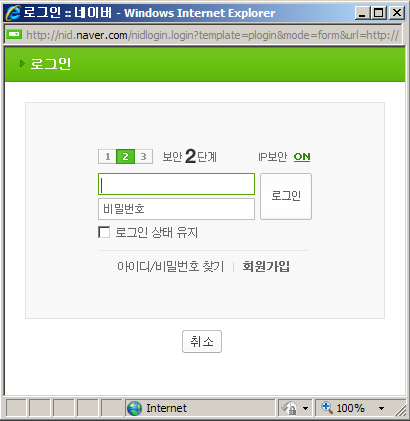
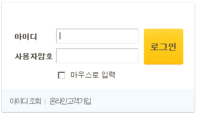

여러분은 지금 어떤 자세로 이 페이지를 보고 있나요? 혹시 턱을 괴고 마우스에 손을 올리고 있지는 않은가요?  
웹서핑을 할 때 많은 시간을 마우스와 함께 합니다. 하지만 가끔 양 손 모두가 키보드 위에 올라오는 때가 있죠. 바로 양식(Form)을 입력할 때 입니다.

양식을 채워서 로그인을 합니다.  
메일을 쓰는 것도 양식을 채우는 일 입니다.  
글을 보고 코멘트를 달아주는 것도 양식을 채움으로써 가능합니다.

즉 양식은 웹을 보는데서 그치는 것이 아니라 더 적극적인 소통을 가능하게 하는 매우 중요한 도구 입니다.

Hours 인터랙션 시리즈의 첫 꼭지는 바로 이 양식에 대한 것입니다.

좋은 인터랙션을 가진 양식 = 적절한 힌트를 주는 양식
------------------------------

 힌트가 없는 입력창 (휑~)

웹페이지에 위 그림처럼 입력창(Input Element) 만 놓여있다면 무슨 내용을 입력해야 할지 알 수 없을 겁니다. 따라서 입력창은 적절한 힌트를 제공해야 합니다.

웹에서 양식에 힌트를 제공하는 기본요소는 Label 과 Placeholder 가 있습니다.

Label과 Placeholder
------------------

문구용품 중에서 라벨이 있죠? Label 은 바로 그 라벨을 생각하시면 됩니다.  
Placeholder 는 언어학적으로 “[문장 속에 필요한 요소이기는 하나 그 자체의 뜻은 없는 것](http://endic.naver.com/enkrEntry.nhn?entryId=6fb0e520f90a4dd796d896fdb3725163&query=placeholder)” 이란 뜻이 있습니다.

HTML 표준 명세에서는 이 둘을 각각 이렇게 정의합니다.  
“label 요소는 사용자 인터페이스에서 캡션을 나타냅니다.”  
“placeholder 속성은 짧은 힌트(한 단어나 짧은 구)를 나타냅니다.”  
“placeholder 속성을 label 을 대체하기 위해 사용할수는 없습니다.”

정의가 한 번에 와닿지 않으신다면 아래 그림을 살펴보세요.

이 것은 아이폰의 메일 계정 설정화면입니다. 여기서 Name, Email 등 까만글씨로 표현된 것이 Label이고 example@gmail.com 같이 회색 글씨로 표현된 것을 Placeholder 라고 합니다.

Label 은 각 입력 항목의 이름을 나타내고 있고, Placeholder 에는 입력할 값의 예라던지 꼭 입력해야 함 등의 부가 정보를 나타내고 있습니다.  
형식 면에서도 Label 은 일반 명사를 사용하고 있지만, Placeholder 는 비교적 자유롭게 적혀있습니다.

두 가지 정보를 함께 사용하면서 어떤 정보를 어떻게 입력해야 하는지, 꼭 입력해야 하는 정보는 무엇인지 한 눈에 알 수 있게 했습니다. UI/UX 에 강점이 있는 애플 답게 Label과 Placeholder 를 적절하게 사용하고 있군요.

커서가 위치해도 어떤 값을 입력해야 할지 알 수 있도록
------------------------------

Label 요소를 입력창 안쪽으로 밀어넣는 것이 최근의 경향입니다. 아래의 로그인창들을 보세요.

두 사이트 모두 Label 요소를 입력창 안에 넣어서 공간을 절약하고 시각적으로도 좋은 디자인을 만들어냈습니다. 아이폰 메일화면의 Placeholder 와 비슷한 모양을 하고 있긴 하지만, 아이디나 비밀번호 같은 것은 Label 이라고 할 수 있습니다.

한가지 중요한 차이는 네이버는 커서가 위치하면 아이디라는 글자가 사라지는 것이고, iCloud는 Apple ID 이라는 글자가 옅게 표시되면서 남아 있는 것입니다.

사실, 네이버의 로그인 창에서 첫번째 입력은 아이디라는 것을 쉽게 추정할 수 있으니 전혀 문제 될 것이 없습니다. [하지만 입력해야할 내용이 사번이었다면](http://hyeonseok.com/soojung/accessibility/2011/06/30/661.html) 단번에 추정하는 것은 어렵지 않을까요? 그래서 이런 방식의 UI는 커서가 위치하더라도 (내용을 채우지 않았다면) Label을 계속해서 보여주는 것이 더 좋습니다.

내 텍스트 커서(Caret)는 어디있을까?
-----------------------

텍스트 커서는 얇고 긴 모양입니다. 그래서 눈에서 놓치면 다시 찾아내기가 쉽지 않습니다. 따라서 내 커서가 어디에 위치하고 있는지 명확하게 보여주는 것이 좋습니다.

이번에는 네이버와 국민은행 사이트입니다. 네이버는 커서가 위치한 입력창의 테두리를 녹색으로 만들어 커서의 위치를 보여줍니다. 반면 국민은행은 커서의 위치를 나타내는 곳을 따로 표시하고 있지 않습니다. 대부분의 평범한 사이트는 이런 형태로 서비스되고 있습니다. 로그인은 입력창이 두 세 개 정도이지만 회원가입과 같이 입력창이 많은 경우는 사용자가 길을 잃는 확률이 높아지므로 커서의 위치를 표시하는 것이 좋습니다.

평범과 비범의 차이는 바로 디테일
------------------

양식의 목적은 사용자가 제작자의 의도를 쉽게 파악해 적절한 정보를 입력하게 하는 것입니다. 이 목적을 잘 달성하려면 좋은 인터랙션이 필요합니다. 그런 의미에서 양식에서의 좋은 인터랙션은 세상에 없는 거창한 것이 아니라 사용자에게 주는 조그만 힌트로 충분합니다. 하지만 평범과 비범의 차이는 바로 그 한 치의 디테일에서 나오는 것이 아닐까요?

관련글
---

-   [입력 서식 안의 레이블](http://hyeonseok.com/soojung/accessibility/2011/06/30/661.html) (hyeonseok.com)
-   [입력 필드 내 텍스트 UI, 어떻게 구현하는 것이 좋을까?](http://elegantcoder.com/label-ui) (elegantcoder.com)
-   [The label element](http://html5.clearboth.org/forms.html#the-label-element) (HTML5 한글 명세, clearboth.com)

이 글은 KTH 디자인실에서 발행하는 [Hours](http://uxd.so/h/good-interaction-with-forms) 에 실린 글입니다.
