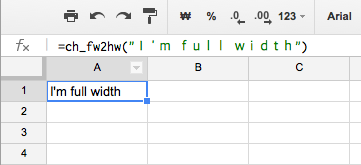
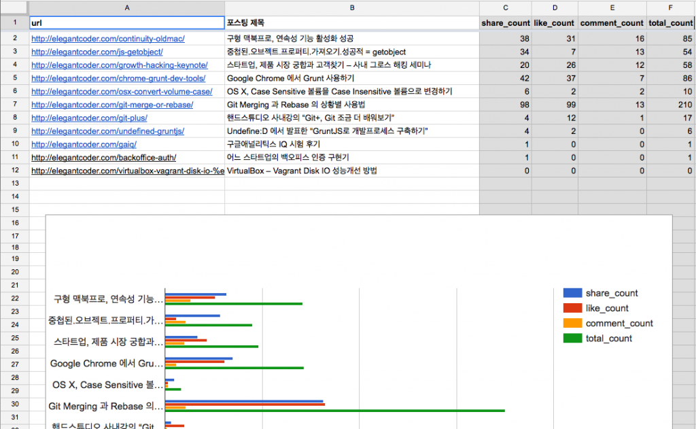
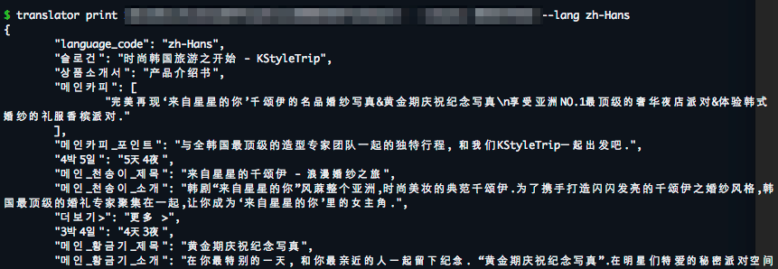
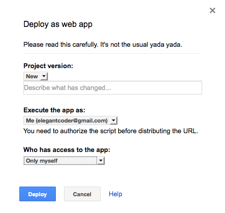

Google IO Extended Seoul 에 다녀왔다. 나는 C 홀에 있었는데 라이트닝 토크 세션이 있고 그 자리에서 발표신청을 해도 된다길래 즉석해서 “스타트업 개발자의 수고를 줄여주는 GoogleSpreadsheet” 라는 주제로 자료를 만들어 발표했다.

5분은 짧은 시간이었지만 개괄적으로 이야기하기에는 충분한 시간이었다. 세션 후에 적극적으로 질문 해주시는 분들을 보고 나에게만 고민스러웠던 주제가 아니구나 하는 생각을 하게 됐다. 발표자료를 공유하고 더 자세한 내용을 블로그 포스트로 적어봤다.

덧) 오프라인 세미나를 준비하고 있다. [구글 설문지](http://goo.gl/forms/GgPpbTx3ZK) 를 통해 의향을 알려주셨으면 한다.

앱이나 웹을 개발할 때 서비스를 구성하는 컨텐츠를 제작해야 한다. 컨텐츠는 맛집서비스라면 맛집데이터 일 수 있고, “이메일 형식으로 입력해 주세요” 같은 문구일 수도 있다. 프로젝트에서 컨텐츠 제작에는 대부분 기획자나 큐레이터 등 별도의 롤을 둔다. 그리고 개발자는 그 컨텐츠를 소프트웨어에 맞게 옮긴다. 그런데 이렇게 옮기는 작업에도 시간이 든다. 한글로 된 컨텐츠라면 맞춤법이 틀린 부분을 발견하고 피드백하는데도 시간이 든다.

그래서 스타트업 개발자는 언제나 시간이 부족하다. 그렇다고 컨텐츠 담당자에게 “데이터를 JSON으로 만들어주세요.” 라고 요청할 수는 없는 것 아닌가. 그래서 지금도 수많은 개발자들이 텍스트데이터를 복사와 붙여넣기 기능으로 JSON 으로, 하드코딩으로 소프트웨어를 만들고 있다.

누구나 이 쯤에서 백오피스로 만들어 처리하면 좋겠다고 생각할 것이다. 하지만 스타트업 개발자에게 그럴만한 여유가 없다. 한시가 바쁜데 서비스와 서비스의 컨텐츠를 구성하는 도구까지 만들어야하는 것이다. 그리고 백오피스를 구축하려면 사내에서만 접속하도록 보안관련 사항을 구축하고 사내에 활용교육도 해야한다. 그리고 구축 후 뭔가 변경되면 그 때마다 교육이 필요하다. 쉽지 않은 일이다.

따라서 개발자는 백오피스를 만드는 데에 보수적이어야 한다. 도구를 갖는 것에 반대해야 한다는 것이 아니다. 빠르게 변하는 스타트업의 비즈니스를 담을 수 있는 은탄환같은 백오피스를 만들기에는 시간이 많이 들기 때문에 쉽게 접근해서는 안된다는 것이다.

그렇다고 도구를 갖지 않을 수는 없으니 백오피스는 스스로 구축하기 보단 있는 것을 조합해 사용하자. 그래서 나는 구글 스프레드시트로 백오피스를 대신하는 것을 추천한다.

왜 구글 스프레드시트인가?
--------------

구글스프레드시트는 모두의 도구다. 특히 IT 에 밝지 않은 사람이 새로운 도구를 익히는데 방어적인 경우가 많은데 그렇다하더라도 엑셀을 다루지 못하는 사람은 드물다. 여기에는 컨텐츠 담당자들에게 손에 익숙한 도구를 쥐어주고 협업을 강화하는데 의미가 있다. 컨텐츠 작성을 컨텐츠 담당자에게 온전히 돌려주고, 개발자가 소프트웨어로 옮기는 작업을 최소화할 수 있다.

구글 스프레드 시트는 강력하다. 기본적으로 엑셀과 비슷한 함수셋을 가지고 있기 때문에 컨텐츠 개발자에게는 반복되는 일을 줄여줄 것이다. 또 필요한 함수가 있다면 개발자가 직접 자바스크립트로 직접 작성해 기능을 추가할 수도 있다. 또 공개된 API 를 사용해 스프레드시트의 내용을 JSON/XML 포맷으로 쉽게 변환해 다운로드 받을 수 있다.

다시말해 구글 스프레드시트는 비 개발자들에게는 손쉬운 도구이면서 개발자에게는 강력한 도구가 된다.

구글 스프레드시트로 백오피스를 대체하는 방법
------------------------

먼저 백오피스에서 입력할만한 데이터의 특성은 읽기에는 열려있고 쓰기에는 닫겨있다. 즉, 입력을 하는 사람은 한정적이다. 하지만 데이터 자체는 어떤 방법으로든 모든 사람에게 공개될 것이다. 예를들면 웹사이트의 “언론보도” 에 들어가는 데이터 정도를 들 수 있다.

### 데이터 입력은 구글 설문지에서

데이터 입력은 어느정도 정규화되어야 한다. 따라서 구글 설문지를 활용하자. 입력값 검증(validation) 도 어느정도 가능하다. 데이터를 입력하는 사람이 한정적이라는 것은 상대적으로 검증에 여유롭다는 말도 되므로 적은 검증으로도 활용할 수 있다.

### 데이터 수정/삭제는 스프레드시트에서 직접수행

설문양식으로 입력받은 데이터는 스프레드시트에 곧바로 들어간다. 따라서 이 시트에서 직접 수정하고 삭제할 수 있다.

### 개발자의 스프레드시트 활용

#### 필요한 함수가 있다면 직접 작성

Google Apps Script 를 통해 스프레드시트에 들어갈 함수를 직접작성할 수 있다.

예를들어 아래 코드는 내가 만든 전각-반각 변환 자바스크립트 함수다. 회사가 중국어를 다루다보니 필요해서 만들게 되었다.

아스키 문자를 입력하더라도 중국어나 일본어 키보드로 입력하면 Ｉ＇ｍ ｆｕｌｌ ｗｉｄｔｈ 처럼 입력된다. 이 때 이 글자들이 바로 전각문자다. 자바스크립트를 사용해 구글 스프레드시트의 함수를 작성하고, 스프레드시트 내에서 이 함수를 호출해 반각문자로 손쉽게 변경할 수 있다.

참고로 전각문자들은 아스키코드와 동일한 순서로 코드가 배열되어 있어 그대로 변환만 하면된다. 다만 영어/한국어로 타이핑 할 때 마침표(.)를 타이핑하면 중국어/일본어에서는 。 로 표시가 되는데, 이것은 아스키코드 순서로 변환할 수 없어 이에 대해서만 별도의 처리를 해주었다. 전각 코드표는 여기에서 볼 수 있다. [https://en.wikipedia.org/wiki/Halfwidth\_and\_fullwidth\_forms](https://en.wikipedia.org/wiki/Halfwidth_and_fullwidth_forms)

```
function ch_fw2hw(string) {
  var re = /([\uFF01-\uFF5E])/g;
  var unicodeStarting = "\uFF01".charCodeAt();
  var asciiStarting = "!".charCodeAt();
  string = string.replace(re, function (match, p1, offset, string) {
      var asciiCharCode = asciiStarting + (p1.charCodeAt() - unicodeStarting);
      return String.fromCharCode(asciiCharCode);
  }); 
  string = string.replace(/。/g, '.');
  return string;
}   
```

이렇게 작성한 코드는 스프레드 시트에서 곧바로 사용할 수 있다.



#### 외부서비스로부터 데이터가져오기, 데이터 내보내기 가능

그리고 URL 로부터 데이터를 받아온다던지 네트워크를 지원하므로 외부 서비스와의 연동도 가능하다. 예를들면 Facebook API 와 연동해 좋아요 횟수를 카운트 할 수도 있다.



여러가지 방법으로 스프레드시트 API 에 접근해 내용을 JSON 으로 받아올 수 있다. API 에 접근하는 라이브러리를 사용해 직접 만들 수도 있고, 외부에서 Apps Script 를 실행해 읽어올 수도 있다.

아래 그림은 내부 프로젝트로 진행했던 translator 의 실행화면이다. 시트의 내용을 그대로 JSON 으로 받아오고 있다.



### 보안문제는 어떤가?

발표 후에 가장 많이 들은 질문이다. 보안이라면 시트자체의 보안과 스크립트 실행권한의 2가지 측면에서 살펴볼 수 있을 것이다.

기본적으로 시트의 공유설정을 통해 받은 사람 외에는 다른 사람은 쓰거나 볼 수 없게 설정이 가능하다. 그리고 그림과 같이 Apps Script 실행권한을 제한할 수 있다. Apps Script 실행권한은 App 이 시트에 접근할 때 어떤 사용자를 대신해 접근하는지와 어떤 권한으로 Apps Script 을 실행할지로 나눠 생각할 수 있다.



다만 Apps Script 에서 접근을 제한하는 경우에는 로그인이 필요하기 때문에 커맨드라인 인터페이스를 통해 Google OAuth 로그인하는 프로그램을 짜야하고 이것은 난이도가 다소 높다.

다시 말하지만 스타트업의 쉴새없이 변하는 비즈니스를 담을 수 있는 백오피스는 없다. 대신 도구를 조합해 최고의 퍼포먼스를 발휘하는데에 집중하자. 사실 나는 이 전에 그런 백오피스를 만들고자 했고, 관리에 실패한 후 이것을 깨달았음을 고백한다.

글을 쓰고보니 코드 한 줄 없이 개발자에게 공부할거리만 지운것은 아닌가 싶다. Apps Script 사용법을 알려드리고 직접 작성해보는 오프라인 세미나를 갖는 것이 좋겠다는 생각이 들었는데 혹시 참석 의향이 있다면 아래 [구글 설문지](http://goo.gl/forms/GgPpbTx3ZK)로 의견을 주시기 바란다. 대략 2~3시간 정도면 Apps Script 의 기본 사용법을 라이브코딩으로 배울 수 있을 것이라 생각한다.