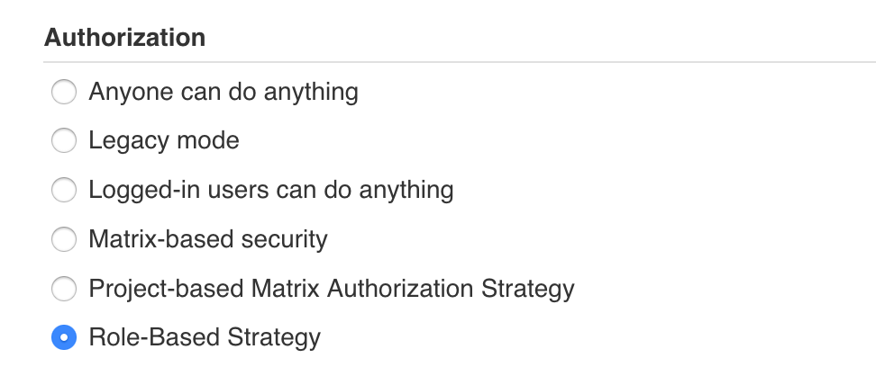
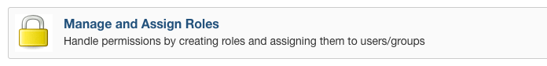
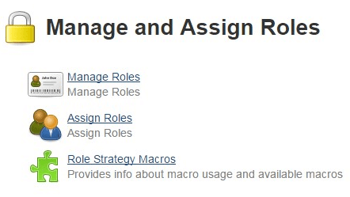
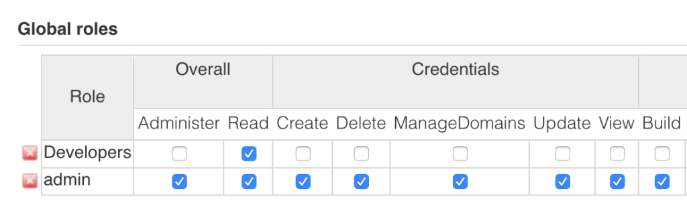
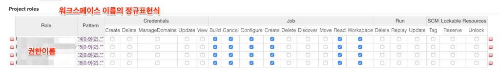
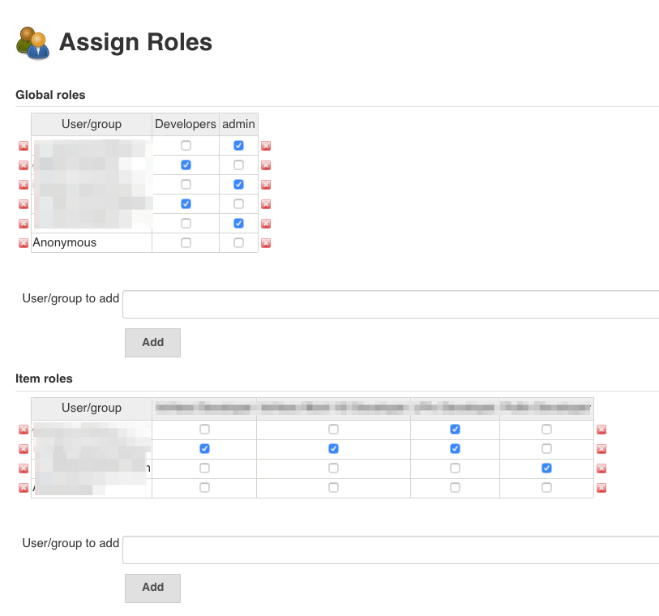

<figure></figure>

Jenkins의 Security Rule 중 Role Based 플러그인을 사용한 사용자 권한 설정을 했다.

Manage Jenkins > Configure Global Security 의 Authorization 에서 Role-Based Strategy를 선택한다.  
(**Enable security** 상태)

<figure><figcaption>Manage Jenkins &gt; Configure Global Security &gt; Authorization</figcaption></figure>

이후  Manage Jenkins > Manage and Assign Roles 화면에서 역할을 추가하고 사용자에 역할을 지정할 수 있다.

<figure><figcaption>Manage Jenkins &gt; Manage and Assign Roles 메뉴</figcaption></figure>

<figure><figcaption>Manage Jenkins &gt; Manage and Assign Roles 화면</figcaption></figure>

<figure><table class=""><tbody><tr><th>Manage Roles</th><td>역할을 추가, 편집, 삭제한다. 전역(Global)과 프로젝트별 역할이 있다.</td></tr><tr><th>Assign Roles</th><td>Manage Roles에서 생성된 역할을 사용자에게 지정한다.</td></tr></tbody></table></figure>

역할에는 Global Roles(전역역할)과 Project Roles(프로젝트 역할)가 있다.  
사용자는 기본으로 전역역할 중 하나를 가지고 프로젝트 역할을 별도로 가지게된다.

Manage Roles 지정방법
-----------------

관리자용 역할(권한이름 `admin`)과 프로젝트별 역할(권한이름 `Developers`)을 분리했다고 가정하면 다음과 같이 Global Roles를 설정한다. **Developers역할이 최소한** `**Overall / Read**` **권한을 가져야 워크스페이스 화면에 접근할 수 있다.**

<figure></figure>

프로젝트 역할은 프로젝트 이름을 패턴으로 매칭한다. 매칭은 정규식패턴이 프로젝트 이름의 전체에 대해 대응해야한다. 작업했던 Jenkins의 프로젝트들은 모두 숫자를 기본으로 가지고 있어서 숫자매칭을 통해 지정했다.

<figure></figure>

Assign Roles지정
--------------

Assign Roles화면에서 Manage Roles에서 추가된 권한들을 확인할 수 있다. (사용자 이름을 추가한 후 확인할 수 있다.) 사용자 이름에 따른 Global roles와 Item roles를 지정할 수 있게 된다.

<figure></figure>
