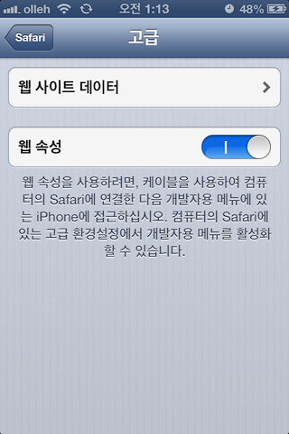
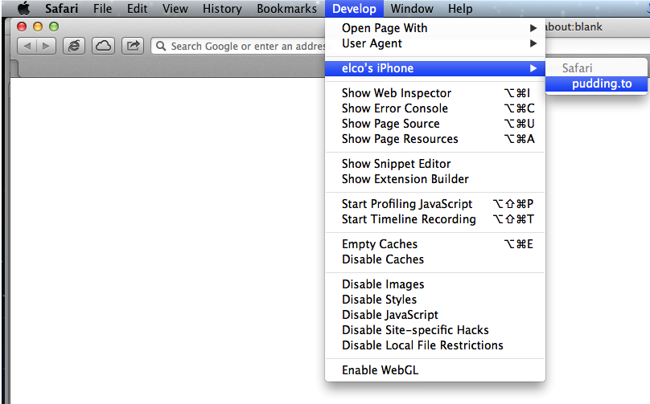
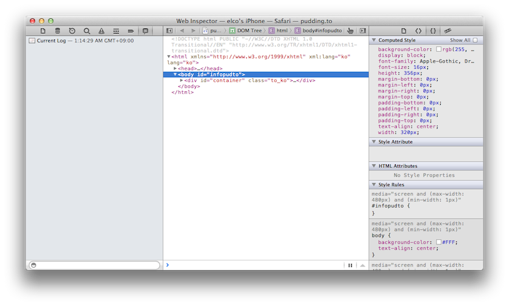

차기 아이폰 출시일이 9월 12일로 예상되고 있습니다. 아울러 iOS6도 출시될 텐데요.  
Front-end 개발자로써 이번 업그레이드가 매우 반갑습니다. 기존의 [Weinre](/weinre)와 같은 3rd party 프로젝트에 의존하지 않는, built-in 개발자 도구 연동기능이 추가되기 때문입니다. 이 기능은 OSX Safari6 와 iOS6 간의 연동으로 이루어 집니다.

대략 어떻게 사용가능한지 빠르게 정리하겠습니다. 환경은 OSX Mountain Lion(10.8.1), Safari 6(8536.25), iOS6 Developer Preview 3 입니다.

준비물
---

-   Mac OSX Lion, or Mountain Lion (Safari 6는 Windows 용이 출시되지 않았습니다.)
-   Safari 6
-   iOS6 Device
-   ***iPhone USB Sync Cable***

디버그 방법
------

-   아이폰 케이블을 맥컴퓨터에 꽂기
-   iOS Device 에서 설정 – Safari – 고급 – 웹 속성 활성화하기  
    
-   iOS Device 의 Safari 를 켜고 디버그 할 페이지에 접속하기  
    
-   Safari 6 의 개발자 메뉴에서 자신의 iOS Device 이름과 디버그할 웹페이지 타이틀이 보이나 확인하기  
    
-   이제 Web Inspector 사용가능!  
      
    

주의할 점은 iOS Device 화면에 Safari 가 올라와있어야 Safari 6 의 개발자 메뉴에서 디버그할 웹페이지를 고를 수 있습니다. 여러 페이지가 켜져 있는 경우에는 골라서 디버그 할 수 있으니 참고하세요.

이번 업데이트로 OSX-iOS에서는 [Weinre](/weinre) 같은 네트워크를 통한 리모트 디버깅 환경을 사용하지 않아도 됩니다. 그리고 케이블로 연결해 디버그 하므로 성능면에서 월등합니다. 하지만 Windows 에서 지원하지 않는 점은 아쉬운 점으로 남겠네요.
