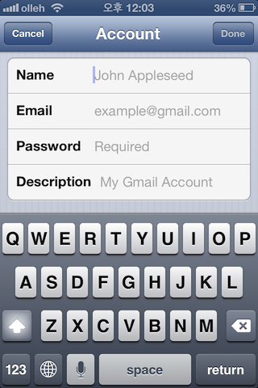
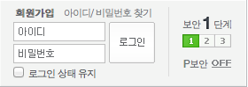
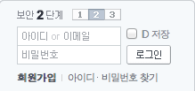
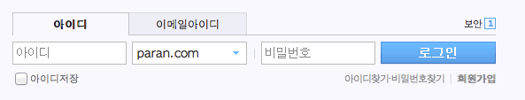
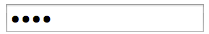
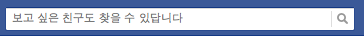
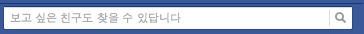

요즘 많이 사용하는 UI 중, 입력 필드 내에 입력정보 텍스트를 표시하는 UI 가 있습니다. 아무래도 placeholder속성이 구현되었을 때와 비슷한 모습을 하고 있어서 placeholder 로 오인되는 경우가 있는 것 같습니다.

Label과 Placeholder 의 차이
-----------------------

잠시 label과 placeholder 의 차이를 알아보고, 구현에 대해서는 아래에서 설명하겠습니다. 

HTML5 표준 스펙에 따르면 ([clearboth.org 의 한글 번역본](http://html5.clearboth.org/spec)을 인용했습니다.)  
[“label 요소는 사용자 인터페이스에서 캡션을 나타냅니다.”](http://html5.clearboth.org/forms.html#the-label-element)  
[“placeholder 속성은 짧은 힌트(한 단어나 짧은 구)를 나타냅니다.”](http://html5.clearboth.org/common-input-element-attributes.html#the-placeholder-attribute)

그리고 placeholder 속성의 설명부분에 “placeholder 속성을 label 을 대체하기 위해 사용할수는 없습니다.” 라 명시되어있습니다.

글로는 감이 잘 안오는데 이 둘은 어떤 차이가 있을까요? 차이를 이해하는데, 아래 그림이 도움이 될 것 같습니다.



위 화면은 iOS의 이메일 설정화면 입니다.  
말하자면 왼편의 Name, Email, Password, Description 부분이 label요소이고, 오른편의 John Appleseed, example@gmail.com, Required, My Gamil Account 가 placeholder 속성으로 표시한 정보라 할 수 있습니다.  
   
label 은 해당하는 인풋 필드에 입력받을 정보를 일반적인 단어를 활용해 표시(캡션)하고 있습니다.  
placeholder 는 John Appleseed나 Required 와 같이 입력받을 정보에 대한 힌트를  나타내고 있습니다.  
   
   
아래는 각 포털의 로그인화면입니다. 위에서부터, 네이버, 다음, 파란 입니다.







모두들 입력 필드내에 입력정보 텍스트를 보여주고 있습니다. 그리고 표준에 따르면 ‘아이디’나 ‘비밀번호’는 placeholder속성 보다는 label요소로 구현해야 적합한 컨텐츠이군요.

입력 필드 내에 텍스트를 표시하는 UI는 이처럼 label 요소를 사용해 표현해야하는 경우가 있습니다. placeholder 속성과 혼동하시면 안되요! 🙂

입력 필드 내 텍스트 UI 구현 해보기
---------------------

이런 UI는 어떻게 구현하는 것이 좋을까요?  
아래 구현내용은 [http://code.elegantcoder.com/blog-examples/label-ui/](http://code.elegantcoder.com/blog-examples/label-ui/ "구현 미리보기") 에서 확인하실 수 있습니다.

1\. Custom Attribute Text 받아 넣어주기
---------------------------------

텍스트 정보이니, 텍스트를 그냥 활용했으면 좋겠습니다. Custom Attribute 을 만들고, 이벤트에 따라 입력 필드의 value를 변경시키는 방법으로 구현을 해봅니다.

### HTML

```
<label for="ex1-id-input" style="display:none;">이메일 주소</label>
<input type="text" value="이메일 주소" data-placeholder="이메일 주소" id="ex1-id-input" />
```

### JS

```
(function example1($) {
  var $id = $('#ex1-id-input')
  var $pw = $('#ex1-pw-input')
  var onfocus = function () {
    $(this).val('')
  }
  var onblur = function () {
    var $this = $(this)
    if ($.trim($this.val()).length === 0) {
      $this.val($this.attr('data-placeholder'))
    }
  }
  $id.on('click focus', onfocus).on('blur', onblur);
  $pw.on('click focus', onfocus).on('blur', onblur);

})(jQuery);
```

그렇지만, 이같은 구현방법은 `<input type="password" />` 내에 value 가 문제가 됩니다. value 의 내용이 아래와 같이 비밀번호 문자로 가려지기 때문입니다.



2\. Background Image 사용하기
-------------------------

이를 회피하기 위한 구현으로, (그리고 비표준인 Custom Attribute 을 사용하지 않기 위해서) 많은 곳에서 CSS의 background-image 속성을 활용합니다. 포커스가 가면, 배경 이미지를 지우고, 포커스가 없거나 블러 이벤트가 발생하면 다시 배경 이미지를 채워주는 방식이죠.

이미 많은 곳에서 이렇게 처리하고 있습니다. 확인결과 위에 캡쳐된 세군데 모두 그렇게 구현이 되어있네요.

### HTML

```
<label for="ex2-pw-input" style="display:none;">비밀번호</label>
<input type="password" value="" id="ex2-pw-input" class="ex2-pw-on" />
```

### JS

```
(function example2($) {
  var $pw = $('#ex2-pw-input')
  $pw.on('click focus', function () {
    $(this).removeClass('ex2-pw-on');
  });
  $pw.on('blur', function () {
    var $this = $(this)
    if ($.trim($this.val()).length === 0) {
      $this.addClass('ex2-pw-on');
    }
  });
})(jQuery);
```

우선 구현 자체는 되었습니다. 동작도 괜찮게 합니다. 하지만, 이 구현법은 배경으로 사용할 이미지를 미리 잘라놓아야 한다는 단점이 있습니다. 이미지를 잘라 표현하니 OS의 기본 폰트가 다른 경우 어색하기도 합니다. 위 그림의 포털 로그인 모듈들은 모두 윈도우 시스템 폰트인 굴림체로 표현되어 있습니다.

3\. Label 을 활용하기
----------------

다른 방법으로 이미 코딩되어 있는 label요소를 활용하면 어떨까요? 

### HTML

```
<div style="position:relative;">
  <label for="ex3-pw-input" style="position:absolute;left:4px;top:8px;">비밀번호</label>
  <input type="password" style="position:absolute;z-index:2;background-color:transparent;" value="" id="ex3-pw-input" />
</div>
```

### JS

```
(function example3($) {
  var $pw = $('#ex3-pw-input')
  $pw.on('click focus', function () {
    $(this).siblings('label').hide()
  });
  $pw.on('blur', function () {
    $this = $(this)
    if ($.trim($this.val()).length === 0) {
      $this.siblings('label').show()
    }
  });
})(jQuery);
```

position:absolute를 사용해 label과 input 을 같은 곳에 보이도록 포지셔닝하고, label 요소를 input 아래에 위치 시킵니다. 또  input 요소의 배경을 투명하게 해서 label 이 곧바로 보이게 만들면, JS를 사용할 수 없는 경우에도 입력이 가능해집니다.

이렇게 구현하면 굳이 이미지를 잘라쓰지 않아도 되고, 입력 필드 안쪽이 OS 기본폰트로 보여지게 됩니다.

-   추가: IE용 구현

IE6~IE8 에서는 배경이 투명한 input 요소는 클릭으로 포커스 이동이 되지 않습니다. 투명 gif 를 이용한 구현을 추가합니다. 

```
<div style="position:relative;">
    <label for="ex4-pw-input" style="position:absolute;left:4px;top:8px;">비밀번호</label>
    <input type="password" style="position:absolute;z-index:2;background:url('./transparent.gif') repeat 0 0 ;" value="" id="ex4-pw-input" />
</div>
```

생각해볼 만한 패턴
----------

 

사족을 붙이자면, 포커스가 이동한 경우 그 부분에 어떤 값을 입력해야 할지를 계속 표시해두는 것도 좋은 패턴이라고 생각합니다. 페이스북을 보면, placeholder 부분을 포커스가 이동하기 전에는 진하게 표시해두었다가, 포커스가 맞춰지면 옅게 표시 합니다. 그리고 키를 입력하면 완전히 지워줍니다.
