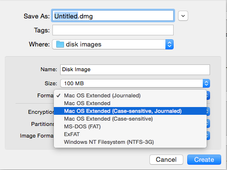

> 최근 들어온 정보에 따르면 El Capitan 에서는 HFS+ 의 Case Sensitive 볼륨을 만들 수 없게 되었다고 합니다. 자세한 사항은 정식버전 출시 후 업데이트 하겠습니다.

OS X 디스크 볼륨은 파일의 대소문자를 구분하지 않는(Case Insensitive) 것이 기본값이다.

하지만 주 업무가 리눅스 서버에 설치되는 프로그램들을 만들다보니 가끔 파일 이름에서의 실수가 발생하는 경우가 있었다. 예를들어 파일이름은 foo.json 인데 프로그램에선 Foo.json 을 로드한다던지 하는 문제가 발생했다. 이런 문제는 서버에 설치되기 전까지는 알아챌 수 없는 문제이다. 그래서 Yosemite 을 설치하면서 대소문자를 구분하는 포맷으로 사용하기 시작했다.

헌데 OS X에서는 Case Sensitive 를 사용하면 각종 애로사항이 발생한다. [구글에서 검색해보면 절규가 들려온다.](https://www.google.com/search?q=osx+case+sensitivie&ie=utf-8&oe=utf-8#newwindow=1&q=osx+case+sensitive) 특히 어도비 제품들은 최신판인 CC 에서도 주 볼륨이 Case Sensitive 로 포맷되어 있으면 인스톨러가 실행조차 되지 않는다.

추정하기로는 OS X 기반 개발자들이 파일의 대소문자를 민감하게 따지지 않아 애플리케이션에 잠재적인 오류 가능성이 있어 설치를 막는 것으로 보인다. 내 경우에도 포토샵 등은 CS6 에서의 Workaround 를 찾아 어찌어찌 해결했지만 Adobe Extension Manager 가 동작하지 않아 플러그인들을 설치할 수 없었다. 참고:[CS6 에서의 Workaround](http://tzvetkoff.net/posts/2013/05/20/adobe-cs6-on-case-sensitive-drives.html)

그런데 Adobe Extension Manager 를 사용해야만 하는 이슈가 발생해서 Case Insensitive 로 변경해야만 했다.

검색해보니 [iPartition](http://www.coriolis-systems.com/iPartition.php) 이라는 앱이 이런 일을 편하게 해준다고 하는데, 가격이 너무 비싸 수동으로 작업했다. 이 작업으로 컴퓨터를 사용하지 못하는 상황은 원하지 않아 2일에 걸쳐 작업했다.

백업은 Carbon Copy Cloner 라는 앱을 트라이얼 상태로 사용했다. 이 앱은 Rsync 를 사용해 하드디스크를 증분 백업해준다. 그래서 첫번째 백업 이후에는 굉장이 빠르다. 자기 전에 하루 저녁동안 백업해두고, 그 다음날 저녁에는 한번 더 백업한 다음 디스크 유틸리티로 복사해놓고 잠들었다. 다음날 아침에 보니 정상적으로 동작하는 것을 확인할 수 있었다.

(350GB 정도 사용한 500GB SSD 와 USB 2.0 외장 500GB HDD 을 사용함.) \* Day 1: Carbon Copy Cloner 로 백업 (4시간 소요된 것으로 추정) \* Day 2: Carbon Copy Cloner 로 증분 백업 (30분 소요), Yosemite 설치 디스크로 Disk Utilities 실행, 백업한 것을 리스토어 (6시간 소요된 것으로 추정)

Case Insensitive 볼륨에서 Case Sensitive 사용하기
=========================================

공교롭게도 위 과정을 거친 바로 다음날 Case Sensitive 관련 문제가 발생했다. git 에서 어떤 파일을 수정한 일이 없는데 계속 수정된 상태로 나오는 것이다.

리모트 리파지토리를 살펴보니 동일한 이름에 대소문자만 다른 두 파일이 있었다. 예를들어 foo.csv 와 Foo.csv 파일 두개가 동시에 존재하는데 대소문자를 따지지 않는 파일시스템을 사용하니 문제가 생긴 것이다.

이 문제는 OS X 의 기본기능인 디스크 이미지를 만들어 해결했다. 디스크 이미지는 겉으로 보기에는 파일 형태이지만 실행(마운트)하면 별도의 디스크 처럼 동작하는 기능이다.

볼륨과 별도로 Sparse Bundle 을 Case Sensitive 로 포맷해 이 쪽에서 내용을 살펴보았더니 파일이 두 개 존재하는 것이 보였다.

그래서 내용을 잘 처리하고 하나의 파일로 다시 만들어 해결했다.

대소문자를 구분하는 디스크 이미지를 만드는 방법
--------------------------

Disk Utility 에서 새로운 이미지를 만들도록 선택하고 이 이미지의 포맷을 Case-sensitive 계열로 선택해 만들면 된다. 생성된 파일을 실행(더블클릭) 하면 디스크로 동작한다.

