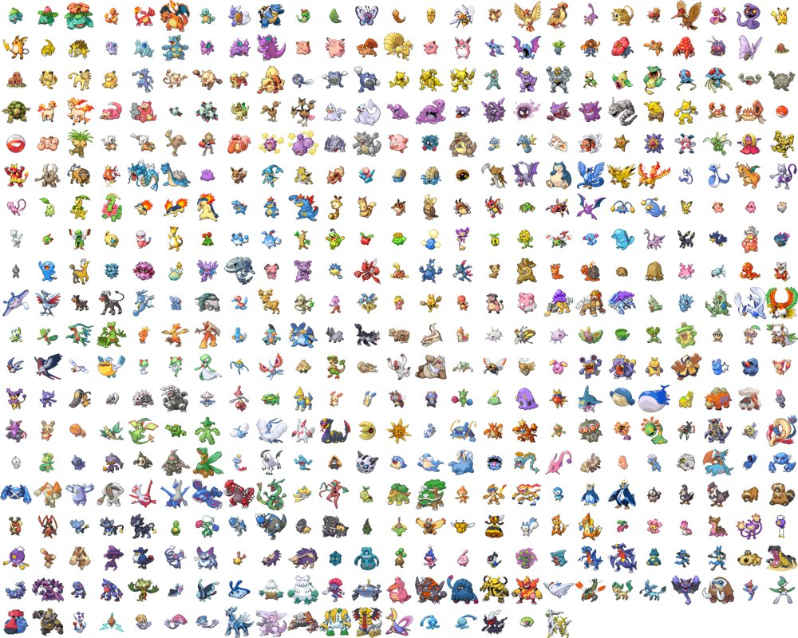

원문은 YUI의 [Professional Frontend Engineering](http://www.yuiblog.com/blog/2009/03/18/video-koechley-prof2e/) 입니다. 스크립트와 함께 보시면 더 좋습니다.

오역/오탈자 신고는 메일로 해주세요.

개요
--

-   야후의 Frontend Engineering 의 역사
-   야후의 철학과 원칙
-   현업에서의 이슈에 대한 지식과 이슈 해결의 최선의 방법
-   왜 이런 것들이 중요한가?

야후의 Frontend Engineering 역사
---------------------------

-   2001년, 야후에 3000명의 직원. 그러나 Frontend Engineer는 한명도 없었다.
-   2001년, 최초로 Frontend engineer를 채용했고, 지금은 지사를 통틀어 700명이 정직원으로 일하고 있다.
-   2001년, `<table>`, `<font>` 로 레이아웃을 잡았고 매우 정적인 UX을 제공했으나, 지금은 의미에 맞는 마크업을 하고 있고, 매우 동적인 UX 및 개인화를 제공하고 있다.
-   2001년, 웹은 거의 html로 이루어졌고, 텍스트 위주였으므로, 테스트도 쉬웠고 전세계적으로 UX역시 매우 안정적/고정적이었다. 지금은 시각적인 웹, 적응적인 웹으로 발전했다. (2001 : static, lilain <-> now : visual, adalitive)
-   2001년, 사용자들은 웹사이트가 어떻게 반응하는지, 어떻게 동작할지에 대해 크게 기대하지 않았다. 지금의 사용자들은 웹사이트가 어떻게 동작할지에 대해 매우 잘 알고 있으며, 요구사항도 까다로워졌다. 즉, UX가 매우 복잡해졌다.
-   마지막으로 2001년, 디자인, 개발의 교차점이 명확하지 않았다. 각 팀들이 각각의 방법으로 일을 했고, 사람들은 front end와 back end를 함께 묶었고, 모호하고 결정되지 않은 프로세스로 작업했다. 그리고 (내 생각에) 오늘날 우리는 개발과 디자인을 모두 아우를 수 있는 교차점인, frontend engineering의 출현을 목도하고 있다.

그렇다면 Frontend engineering 이란 정확히 무엇인가? 이를 정의하는 몇가지 방법이 있다.

### 우리는 JS, CSS, HTML을 이용해 소프트웨어를 작성하는 존재이다.

여기서 나는 의도적으로 “소프트웨어를 작성”한다고 표현했는데, 왜냐하면 우리가 하는 일이 그저 페이지를 마크업하고 그래픽을 배치하는 문제가 아니라는 것이다. 오늘날의 웹사이트들은 소프트웨어 어플리케이션으로 꾸며져있다. Yahoo! 홈페이지이든, Yahoo! 메일처럼 더욱 전통적인 어플리케이션이든 관계없이 복잡하고 많은 양의 JS와 여러 소프트웨어로 만들어져있으며, 이런 페이지를 클라이언트 사이드의 가장 끝에서 작동시킨다. 따라서 우리는 소프트웨어를 작성하는 존재이다.

### 우리를 정의하는 또다른 방법은, frontend engineer는 브라우저에게 무엇을 할지 지시한다는 것이다.

이런 일이 쉽다면 참 좋은 일이겠지만, 브라우저의 다양성과 브라우저의 기능들의 다양성이 우리의 일을 어렵게 한다

### 우리는 “소스 보기” 에 책임이 있다고도 말할 수 있다.

따라서 우리의 조직이나 팀이 어떻게 구성되든, front engineer는 사용자 브라우저에 뿌려지는 모든 것에 책임이있다. 만약 여러분이 어떤 페이지에서건 “소스 보기”를 한다면, 여러분이 보는 모든 것은 곧 frontend engineer가 결정한 것의 결과물이다.

여러분이 서버사이드의 관점에서 Frontend engineering을 얕잡아볼 수도 있겠지만, Frontend engineer도 엄청나게 많은 기술들을 마스터해야한다.

### Frontend engineer가 가져야할 지식 중 한가지는 HTML에 관한것이다.

이것은 그저 아는 것과는 다르며, 여러 차원에 대해 아는 것이다.

### 언어의 명세(specifications)에 대해 아는 것이다.

즉, 무엇이 가능하고, 무엇이 옳으며, 언어가 어떤 기능을 지원하도록 설계되었는가?에 대해 알아야 한다.

### 그 기술이 실제로 어떻게 구현되었는지 이해하는 것이다.

각 브라우저들은 스펙의 일부분만 구현하기도 했고, 기능을 추가해 놓기도 했다. 따라서 스펙을 이해하는 것 외에 브라우저가 스펙을 어떻게 구현해놓았는지 이해해야한다. 그리고 다른 구현물과 마찬가지로 여러 버그와 쿼크(quirk) 가 있으며, 스펙, 실제 구현, 알려진 버그를 이해하는 것 모두 중요하다.

지금까지는 단지 HTML에 관한 것일 뿐이었고, 다른 영역들도 많이 있다. 문서 객체 모델(DOM),CSS, 브라우저와 상호작용하고, 문서와 상호작용하는 API, Javascript, 또 최근 몇년간 많이 발전한 Ajax, JSON, XML, 또는 여러 다른 데이터 형식 등 도 있다.

지식의 범위가 매우 많고, 각 지식범위는 많은 차원을 가진다. 그리고 이들을 각 OS별, OS별 각 브라우저들, 각 브라우저의 각 버전에 대해서도 알아야 한다.

아 참. 브라우저마다의 렌더링 모드도 있다. 대략 계산해보면, 우리가 웹사이트를 만들 때 관리해야할 항목이 672가지에 달한다. 나는 이런 항목들이 사용성, 성능, 보안 만큼이나 중요하다고 여긴다.


때때로 Frontend engineer들은 원하는 효과를 달성하기 위해 어떻게 해야할지 모른다. 이것이 더욱 더 우리의 일을 어렵게 하는 일이다. Douglas Crockford는 브라우저를 “상상할 수 있는 한의 최악의 소프트웨어 개발 환경”이라고 표현했다. 물론 모바일에서는 더욱 안 좋아진다.

Frontend의 작업은 backend작업과는 근본적으로 다르다, 왜냐하면 우리는 무엇도 컴파일할 기회를 갖지 못하며, 사용자들의 장비가 다양하므로 무엇이 어찌 작동할지 믿기 어렵고, 무엇도 예측할 수 없으며, JS에서 어떤 일이 일어날 지 믿을 수 없으므로, 우리는 언제나 방어적 자세를 취해야 한다. 성능상의 관점에서, 우리는 프로그램을 설치시킬 수 없고, (HTTP의 무상태라는 특성때문에)클라이언트에 저장시킬 수 없다. 그리고 재미있는 것은, 우리는 소스코드를 숨길 수 없다. 따라서 작업물을 모든 사람 볼 수 있으으로 깔끔하게 유지해야 한다.

하지만 이런 것들은 frontend가 backend와 다른 이유들과, 이 작업의 복잡성(complexity)의 일부일 뿐이다. 그리고 이 들은 엄청나게 중요하다. Yahoo!의 가치는 온라인에 존재함에서 나온다. 많은 회사들이 그들의 가치를 그들의 웹사이트로 부터 뽑아내고, 이 모든 것은 frontend engineer의 작업에 의존한다.

야후의 철학과 원칙
----------

### 야후의 원칙

#### 가용성

가용성은 웹사이트 구축의 기반이다. 사이트가 사람들에게 서비스 될 수 없다면 게임 오버다. 그리고 이런 가용성은 모두에게 적용되어야 한다. 가용성이란 즉, 접근성의 상위개념이다.

#### 개방성

웹은 개방된 기술과 개방된 플랫폼 위에서 만들어졌다. 취미로 웹을 하는 사람이나, 웹 개발자들은 소스보기와 역공학(reverse engineering)를 통해 무엇이 어떻게 동작하는지 알아낸다. 이런 개방성은 웹의 핵심부분이고, 웹을 건강하고 생동할 수 있도록 하는 핵심부분이다. 그리고 개방성에는 앞서 언급한 철학적인 목표가 있을 뿐 아니라, 우리가 하는 일을 이해하는 생존전략이다. 우리가 배우는 것을 공유하고, 더 나은 기술, 더 나은 적용방법, 더 나은 정책을 추구하는 것은 중요하다. 왜냐하면 이들은 우리를 포함해 전세계 모든 이에게 이득을 주는 건강한 인터넷을 만들 것이기 때문이다. 개방성은 이 모든 것의 뿌리라고 생각한다.

#### 풍요함(richness)

DHTML 개발과 Ajax 개발은 지난 5년간 굉장히 성장했고, 그것은 우리가 언제나 애써왔던 방향이다. 소프트웨어 디자이너, 인터페이스 디자이너, frontend engineer 로써 사용자에게 유용한 도구를 만드는 것이 우리의 일이다. 하지만 우리의 첫 원칙인 “가용성”을 잊지 말아야 한다. 따라서, 풍요로움과 가용성 사이의 균형을 이루어야 한다. 우리의 장비, 컴퓨터 사용 수준 등이 평균적인 사용자(average user)가 아니라는 것을 잊지말아야 하고, 사용자들은 굉장히 다양한 환경에서 접속하므로 사이트를 방어적으로 만들어야 한다.

#### 안정성

우리는 안정적인 사이트를 만들기 원한다. 따라서 가용성의 관점에서 모든 것이 잘 동작하는지 언제나 확인해야한다. 하지만 안정성이라는 단어를 미래를 내다보는 관점으로도 사용할 수 있다. 웹은 아직 젊기때문에 앞으로 어떤 기술이 개발되고, 무엇이 발명될지 모른다. 따라서 안정성, 강력한 인프라스트럭쳐, 안정적인 코드에 계속적으로 투자하는 것이 중요하다. 이런 투자를 통해 우리가 차후 강력한 플랫폼을 갖게 될 것이기 때문이다.

지금까지 4가지 가이드 원칙에 대해 알아보았다. 이제 이런 원칙들을 지원할 세가지 핵심 기술을 알아보자.

#### 점진적 개선

점진적 개선이란 우아한 성능저하의 반대말이다. (Graceful degradation & progressive enhancement) 우아한 성능저하는, 무언가 되지 않는 것을 발견했을 때 기능을 떼어내는 방법이고, 지속적인 개선이란 강력한 핵심기능에 기능을 조금씩 덧붙여 만드는 방법이다.

##### 점진적 개선을 위한 규칙

-   마크 업을 통해 컨텐츠를 구성
-   HTML 만을 사용해 핵심 기능을 테스트
-   CSS를 통해 레이아웃을 개선
-   JS를 통해 동작을 개선
-   사용자 브라우저 설정을 침해하지 말 것.(CSS를 사용하지 않는 설정, JS를 사용하지 않는 설정, 글자크기 등)
-   진입장벽을 만들지 말 것.(HTML만 사용하는 브라우저로도 접근 가능하게 할 것)

#### 나서지않는 Javascript(Unobtrusive Javascript: 겸손한 Javascript)

-   HTML 문서에서 Javascript를 제거
-   Javscript에 의존하거나, 믿지 않도록 함.
-   (브라우저마다 객체이름, 지원하는 객체에 차이가 있으므로) 객체 사용전에 유무를 체크함
-   전역변수를 남발하면 전역 네임스페이스를 침해할 수 있으므로, 사용시 주의할 것.
-   마우스로만 접근하는 것이 아니라 키보드로 접근하는 경우도 있으므로 onclick, onmouseover 와 같은 이벤트 사용시 onfocus와 같이 대응되는 이벤트를 고려할 것.

#### 브라우저 지원을 분리시킴.

-   브라우저 지원은 지원 하느냐 하지 않느냐의 이분법적인 문제가 아니다.
-   브라우저를 지원한다는 것이 픽셀단위까지 동일하게 보여준다는 의미가 아니다.
-   브라우저를 세 등급으로 나누어 관리한다.

##### 브라우저의 3등급

###### C 등급

-   현대적이지 않은 브라우저 들.
-   CSS와 JS 제공안함.
-   블랙리스트를 만들어 관리함.
-   이런 브라우저로 접근시, 마크업이 잘 된 상태로만 보여주고, JS, CSS를 로드하지 않음.

###### A등급

-   CSS와 JS를 제공.
-   엄격한 QA테스트
-   픽셀단위까지 맞춤.

###### X등급(어떤지 모호하다는 의미로 X를 사용함)

-   C등급과 A등급 이외의 나머지 브라우저들
-   JS와 CSS를 지원한다고 가정하고 제공.
-   장차 오래되어 최신의 JS와 CSS를 지원하지 않게되면 C등급으로 재 분류

현재 Yahoo!에서의 브라우저 등급 리스트 [GBS](http://elegantcoder.com/wp-content/uploads/2011/06/672dimensions.png)

상기 등급리스트의 A등급에 해당하지 않는 브라우저 버전 및 OS버전에서는 QA테스트를 진행하지 않음.(X등급으로 처리)

현업에서의 이슈에 대한 지식과 이슈 해결의 최선의 방법
------------------------------

위의 핵심 테크닉에 도달하기 위한 구체적인 방법은 아래와 같다.

-   표준이 있다면 표준에 따라라.
    -   아직 표준화 되지 않은 것이 있거나, 표준화가 진행되고 있는 것이라면 업계의 관행을 따르는 것도 괜찮다. 이런 과정이 실패하는 특수한 경우에는 기획으로 돌아가 목표를 달성하기 위한 기술들을 제안하자. 이런 과정은 더 건강한 인터넷, 프로젝트의 안정성을 위한 좋은 방법이다. 아직 익숙하지 않은 업무인 경우 개방성의 원칙을 기억하고, 문서화하며, 다른 사람들에게 공개하고 논의해 장래에 표준이 될 가능성을 주도록 하자.
-   단순화 하고, 유연하게 하고, 개방하자.
    -   많은 경우, 단순한 것이 아름답다. 유연하게 만들면 사내의 여러 사람에게 도움을 줄 수 있고, 업계 종사자들에게도 도움을 줄 수 있다. 예를들어 별점 기능의 위젯이 사진 사이트에서 뿐 아니라 영화 사이트, 블로그 등등에서 사용될 수 있도록 하자. 마지막으로 개방하자. 우리가 배운 것을 문서화하고 API를 제안하자.
-   우리는 여러 대상에게 만족을 주어야 한다.(사용자뿐 아니라 기기도 만족시켜야 한다)
    -   만약 어떤 Javascript 패턴이 더 압축적이고, 이것이 사용자, 협업하는 다른 개발자들에게 동일하다면, 기기에 최적화 된 패턴을 사용하도록 하자. 하지만 언제나 기억해야 할 것은, 우리가 최우선으로 고려해야 할 것은 사용자이므로, 더 좋은 사용자 경험을 제공하기 위해서 더 고민하는 것은 괜찮다. 그것이 우리의 일이므로.

조금 더 구체적인 지식 범위와 최선의 방법들을 알아보자.

HTML(Content Layer: 내용 계층)
--------------------------

-   doctype
    -   doctype은 브라우저에게 렌더링 모드를 지정하기 때문에 중요하다. 렌더링 모드에는 표준모드와 quirks 모드가 있다. 2000년대 초반 표준을 지키는 브라우저들이 나오기 시작하면서 기존 사이트들이 의도하지 않게 보여지는 문제가 발생했다. 기존 사이트들과의 호환성을 위해 doctype을 포함하게 해서 렌더링 모드를 지정하도록 했다.
-   마크업
    -   CSS reset
        -   브라우저마다 기본으로 포함된 CSS를 통해 같은 태그들을 다르게 보여준다. 따라서 “CSS Reset”을 통해 기본적인 스타일링을 초기화해서 사용한다. YUI의 CSS reset 사이트
    -   마크업의 원칙
        -   자주 사용되지 않고, 잊혀져 가는 태그들이 많다. 각 태그의 용도대로, 최대한 사용하자.
    -   잊혀져 가는 태그 및 속성을 활용하자
    -   `<table>`, `<caption>`, `<thead>`, `<tbody>`, `<tfoot>`, `<th>`, `summary` 속성, `headers` 속성, `scope` 속성, `abbr` 속성, `<form>`, `<fieldset>`, `<legend>`, `<label for="">` !\[잊혀져 가는 태그들\]\[4

### 어떤 마크업이 더 나은가?(1)

1.

```
<dl>
    <dt>List of Stuff</dt>

    <dd>Snickers</dd>
    <dd>Mounds</dd>
</dl>
```

2.

```
<h3>List of Stuff</h3>
<ul>
  <li>Snickers</li>
  <li>Mounds</li>
</ul>
```

1번은 헤더(List of Stuff)와 컨텐츠 간에 관계를 만들었고, 2번은 헤더태그(`h3`)를 사용했다. 왜냐하면 List of Stuff가 의미하는 바가 바로 헤더이기 때문이다. 어떤 것이 최선일지 딱 정할 수 는 없다. 다만, 마크업을 할 때 지금 하고 있는 일이 어떤 것에 해당하는지를 이해하고, 당신의 시나리오에서 최선의 선택을 하라.

### 어떤 마크업이 더 나은가?(2)

1.

```
<div id="footer">© 2009 Yahoo! Inc. | 이 내용은 변경 가능함.</div>
```

2.

```
<div id="footer"><p>© 2009 Yahoo! Inc. | 이 내용은 변경 가능함.</p></div>
```

변경이 가능한 상황에서 1번과 2번 중 어떤 것이 더 나은가? 1번은 곧바로 내용으로 들어가므로 가볍다는 장점이 있다. 하지만 나는 2번이 더 좋다고 생각한다. 왜냐하면 `div` 는 영역을 나타내고 있고, 그 아래 `p` 가 내용을 나타내고 있기 때문이다. 만약 정보 제공자가 Yahoo! 이외에 더 추가된다면, 영역을 나타내는 요소가 중복해서 들어가야 한다는 위험성이 있다.

#### div 중독 & class 중독 (divitis & classitis)

마크업을 할 때 div와 class를 남용, 오용하지 않도록 해야 한다. 이를 위해서는 가장 의미있는 엘리먼트를 찾고, 쓸모있는 DOM 구조를 만들어야 한다.

`div` 중독의 징후 – `div`가 너무 많고, 각각은 class 속성들과 과도하게 관련되어 있다.

```
<div id="news">
    <div class="headline">News Headline</div>

    <div class="source">NY Times</div>
    <div class="date">Oct 17th, 2008</div>
    <div class="paragraph">Lorem ipsum...</div>

    <div class="headline">News Headline</div>

    <div class="source">LA Times</div>
    <div class="date">Oct 17th, 2008</div>
    <div class="paragraph">Lorem ipsum...</div>
</div>
```

더 나은 방법

```
<div class="mod" id="news">
    <h3>News Headline</h3>
    <cite class="publisher">NY Times</cite>

    <cite class="date">Oct 17th, 2008</cite>
    <p>Lorem ipsum...</p>

    <h3>News Headline</h3>
    <cite class="publisher">LA Times</cite>

    <cite class="date">Oct 17th, 2008</cite>
    <p>Lorem ipsum...</p>
</div>
```

DIV가 우선 모든 것을 감쌌다. 그 이유는, 보이기로는 라운드코너를 사용하든, 그림자를 넣든, 말풍선을 사용하든, 사실 그 뼈대는 네모이기 때문이다.

우리는 이런 레벨의 DIV를 표준 모듈 형식(Standard Module Format)이라 부른다. 페이지의 모든 컨텐츠 조각, 페이지의 모든 컨텐츠 덩어리가 바로 모듈이고, 따라서 우리는 이들을 DIV로 묶고 MOD라는 클래스이름을 준다. 각 모듈들은 그 구조에 따라 header, body, footer 영역을 가질 수 있다. 표준 모듈 형식을 통해 우리는 모든 컨텐츠들을 감싸는 새로운 구조를 갖게 되었고, 따라서 예측가능하고 어디에나 적용할 수 있는 믿을만한 구조를 갖게 되었다. 이 구조는 플랫폼의 일부가 될 수 있고, 우리가 구축하려고 하는 것들의 단단한 기초가 되었다.

#### Standard Module Format

```
<div class="mod">
    <div class="hd"></div>
    <div class="bd"></div>

    <div class="ft"></div>
</div>
```

아래 그림은 표준 모듈 형식으로 만들어진 야후 탑페이지의 News 부분이다.


위 그림과 같은 것을 구현해 낼 때, 우리는

1.  가장 안쪽에 위치한 컨텐츠에서부터 시작해 의미상으로 어떻게 마크업을 하는 것이 가장 좋을지를 도출한다. 
2.  의미에 맞게 마크업 후, 이것이 모듈이므로, 모듈을 나타내는 DIV로 감싸고 유일한 id를 준다. 
3.  이 표준모듈에 header영역, body영역, footer영역을 준다. 

이 표준모듈형식은 여러 컨텐츠 영역에 적용될 수 있을 만큼 충분히 유연하고 단단하고 예측가능한 토대를 제공하게 되었다.

CSS(Presentation Layer: 표현계층)
-----------------------------

### CSS를 페이지에 어떻게 넣어야 할까?

최선의 방법은 `<link>`를 사용하는 방법이다. 물론 인라인으로 넣을 수도 있고, `<style>`을 쓸 수도 있고, `<style>`에 `@import`를 사용할 수도 있다. 하지만, 가장 성능이 좋고 깔끔한(cleanest) 방법은 문서의 `<head>` 내 에 `<link>`를 사용하는 것이다.

### class와 ID의 사용

우리가 class나 id를 CSS의 관점에서 생각하고 있지만, 사실 이들은 HTML 계층이다. 이들은 HTML 그 자체내의 값(value)이거나 값을 갖는 속성이라고 말할 수 있다. 이들이 HTML 소속이므로, 이들은 HTML을 작성할 때 우리가 지키는 원칙에 따라 작성되어야 한다. 즉, 최대한 의미에 맞게 짜여져야 하고, HTML 문서를 더 풍성하게하고, 문서에 의미를 더해주는 방식으로 사용되어야 한다. 이전에 나는 class들이 “엘리먼트의 하위분류(element subclass)”로 생각될 수 있음을 이야기 한 적이있는데, 같은 태그를 용도에 따라 구분하고자 할 때가 바로 class를 사용해야할 시점이다.

### ID의 세가지 역할 (Matt Sweeney)

1.  HTML 계층에서 각 ID는 페이지의 특정 위치에 접근할 수 있도록 하는 URL의 fragment identifier 이다. 따라서 1. 적절한 의미의, 2. 사용자에게 친숙한, 읽을 수 있는 값을 지정해야 한다. (`foo.html#weather`)
2.  ID는 CSS에서 편리하게 사용할 수 있는 선택자(selector)로 사용된다. (`#weather {}`)
3.  Javascript에서도 쉽게 요소를 선택할 수 있도록 한다. (`document.getElementById('weather')`)

### 단단한 문서 구조

단단한 문서구조를 만드는 것은 frontend engineer들이 더 나은 삶을 살 수 있도록 한다.

```
<style>
        h3 {font-size : 107%;}
         a {color: red;}
    cite a {color:blue;}
</style>

<div class="mod" id="news">
    <h3>In The News</h3>
        <ul>
            <li>
                <a href="">Something happened</a> -
                <cite><a href="">NY Times</a></cite>

            </li>
        </ul>
</div>
```

Something happened에는 빨간색으로, NY Times에는 파란색을 주고 싶다면, 위와 같이 ID와 class의 추가 없이 구조적 DOM의 장점을 활용해 cite유무에 따라 구분이 가능하다. 여기에 #mod h3{}, #mod a{}, #mod cite a{} 와 같이 상위에 ID를 지정하게 되면 모듈에 따라서 스타일을 입힐 수 있게 된다.

### 배경 이미지, 큰 단일 이미지를 position을 변경하면서 보여주는 방법(CSS Sprite)



### CSS 필터/핵 문법

```
#selector {
  width : 100px;      //for everybody
  *width : 120px;     //for IE 6,7
  _width : 110px;     // for IE6
}
```

어떤 사람은 이런 것들이 문법적으로 올바르지 않은 CSS파일을 만든다고 불평하기는 하지만, 우리는 이것이 현명한 거래라고 생각한다. 왜냐하면 특정 페이지를 나타내는 속성들을 한 곳에 모을 수 있기 때문이다. 위의 필터는 꽤 알려진 것이기 때문에 소스를 보거나, 유효성 검사기에서 오류로 나타나더라도 헷갈리지는 않는다.

### hasLayout문제

hasLayout이 IE 6와 7에서만 가지고 있는 속성이기 때문에 문제도 이 두 버전에서만 나타난다. 개념을 잡기 위해서는 이 문서를 읽어보기 권한다. hasLayout이슈는 IE 에서의 많은 문제들의 원인이다. 해결방법은 zoom:1;이 있다.

### Javascript(Behavior Layer: 행동계층)

#### 나서지 않는 Javascript (Unobtrusive Javascript: 겸손한 Javascript)

위의 나서지 않는 Javascript에 대해 설명한 것을 더 자세히 설명하자면, HTML에는 Javascript 코드를 전혀 넣지 않아야 한다. 예를 들어, 아래와 같은 코드가 있다면,

```
<a href="help.html" onclick="helpPopup()">help</a>
```

아래 코드가 더 낫다.

```
<a href="help.html" id="myID">help</a>

<script>
    addListener("myID", "click", helpPopup);
</script>
```

즉, onmouseover, onmouseout 과 같은 이벤트 핸들러들이 HTML 문서에 포함되지 않도록 하고, 나중에 Javascript를 통해 적용시키자.

#### Javascript는 기능 강화용으로 사용하자

예를 들어, Drag and Drop으로 순서를 정렬하고, 정렬될 때 Ajax로 순서를 정하는 페이지의 경우, Javascript를 지원하지 않는다면 셀렉트박스를 사용해 순서를 지정하고, 폼을 제출했을 때 적용되는 방법을 사용할 수 있다. 즉, Javascript를 통해 사용자 경험을 강화하고, 지원하지 않는 경우에도 중요한 기능은 유지되도록 해야한다.

#### 객체가 존재하는지 검사하자

엘리먼트의 색상을 변경하는 아래와 같은 코드를 생각해보자.

```
function color(o, col) {
  o.style.background = col;
}
```

만약, o 라는 엘리먼트가 없다면 이 코드는 에러를 낼 것이다.

이 코드를 아래와 같이 바꿔보자.

```
function color(o, col) {
  if(o) {
    o.style.background = col;
  }
}
```

객체가 존재하는지 미리 체크하므로, 존재한다면 원하는 효과를 낼 것이고, 존재하지 않으면 사용자 경험을 해치지 않고 별 다른 메시지를 내지 않으면서 작동하지 않을 것이다.

#### 유효성 검사(Validation)

Javascript에서 가장 좋은 유효성 검사기는 JSLint 이다. 여기서 나는 “유효성 검사”의 뜻을 조금 더 확장시켜 사용했다. 왜냐하면 유효성 검사라는 말을 스펙에 엄격하게 맞는 지 검사한다는 뜻 뿐아니라, 건강한 Javascript에 반하는 코딩 습관들까지도 검사한다는 뜻으로 사용했기 때문이다. JSLint는 Douglas Crockford가 만든 것이고, Javascript로 짜여진 Javascript 프로그램이다. 이 프로그램은 세미콜론이 빠진 것, Array 마지막 요소 후의 콜론, 굳이 전역변수일 필요가 없는 전역변수 등을 찾는다. 즉, 코드에서 보푸라기(lint)를 찾아주어 코드를 더 건강하게 하는 것이다.아마 이 도구를 도입하면 처음에는 기분이 좀 상할 수도 있겠다. 왜냐하면 더 좋다고 생각되는 코드를 엄격하게 강요하기 때문이다. 우리의 코드품질은 이 도구를 사용하기 시작하면서 부터 정말 엄청나게 높아지고있다. 하지만 Javascript 코드 작성의 개인적인 스타일을 고치는 데에는 학습곡선이 필요할 것이다. 디버깅을 할 때, 동료에게 코드 디버깅을 요청할 때, 예절바르게 JSLint님께 먼저 물어보고 사람들이 일반적으로 아하!(gotcha) 하는 부분을 챙겨보자. 디버깅을 할 때의 모든 일반적인 버그상황을 피할 수 있으므로 당신의 시간을 아껴줄 것이다.

#### 최적화

최적화 관점에서, 두가지 방법을 추천한다. 첫번째는 YUI compressor 를 사용해 코드를 줄이는 것이다. 이 프로그램은 긴 단어를 짧게 하고, 공백과 주석을 제거한다. JSLint가 모든 세미콜론을 정확한 위치에 사용하도록 하기 때문에 JSLint이후에 이 프로그램을 사용하면 공백을 줄였을 때 따르는 문제가 전혀 없으므로 완전히 안전하다고 할 수 있다. 따라서 JSLint와 YUI compressor를 사용하면 사람이 읽기는 어렵지만, 사용하기 쉽고, 압축된 코드 묶음을 얻을 수 있다. YUI compressor는 Javascript 뿐 아니라 CSS에도 적용할 수 있다. CSS에도 마찬가지로 주석과 공백을 없앤다. 많은 경우, 코드를 소스 저장소(SVN 등)에 체크인할 때 자동 실행되도록 빌드 프로세스에 넣는 것이 매우 유용하다.

더 많은 Javascript 소프트웨어를 만들 수록 전통적인 컴퓨터 과학의 관습을 더 많이 받아들이게 된다. 그 중 하나는 바로 단위 테스트이다. YUI Test는 Javascript 단위테스트를 작성하기 위한 테스트 프레임워크이다. 간단한 문법으로 구성되어, 정말 빠르고 쉽게 단위테스트를 빌드할 수 있고, 좋은 기능들도 많이 있다. 예를 들어 DOM event를 시뮬레이션할 수 있어서 여러브라우저에서 테스트가 가능하고, 어떤 인터랙션을 할지 스크립트로 짜두고 결과를 살펴볼 수 있다. 테스트 코드의 크기가 너무 크다면 그룹으로 만들고, 이 여러 그룹을 한 묶음으로 만들 수도 있다. 또, 어떤 코드들의 속도측정도 가능하다.

#### 마지막으로, 데이터 전송이다.

Yahoo! 에서는 Ajax 기반의 통신을 다룰 때 YUI의 Connection Manager를 사용한다. 이 프로그램도 많은 기능이 있다. 모든 폼을 묶어 직렬화(serialize)할 필요 없이 한번에 전송하는 기능도 그 중 하나다. 우리는 데이터를 전송할 때 XML보다는 군살없는 JSON형식을 많이 사용한다. 이는 JavaScript가 스스로 지원하는 방법이고, 매우 가볍고, 플랫폼에 의존하지 않기 때문이다.

데이터 전송에 대해 한가지 더 말하자면, 데이터 전송시에는 꼭 보안을 신경써야 한다. frontend engineer들은 주 업무가 보안이 아니다. 하지만 우리의 코드는 노출되어있고, 따라서 이 코드 때문에 보안문제가 생길 여지도 있다. 보안에 대해 잘 모르겠다면 Yahoo!에는 보안 컨설팅 그룹이 있으므로 문의해야만 한다. 서버와 통신할 때는 언제나 주의하고 그리고 이따금씩, 지속적으로 보안문제가 우리가 신경쓰는 모든 것이 되어야 한다.

### 왜 이 모든 것이 중요한가

우리의 디자이너에게 영감을 불어넣고 교육을 하는 것은 대개 우리의 일이다. 오랜 시간 동안 우리는 디자이너에게 이런저런 일들을 할 수 없다고 말해왔다. 우리의 대답이 바뀌기 시작하면, 디자이너들도 진의를 바르게 파악할 것이다. 그리고 그렇게 되면 그들도 할 수 있는 한 최선을 다할 것이다. 따라서 나는 이것이 우리의 일이고, 어떤 것이 가능한지를 그들에게 보여주어야 한다고 생각한다. 새로운 인터렉션에 대해 프로토타입을 제작하고, 그들을 위해 한계를 넓혀보자. 이것은 우리가 디자인을 잘 해서가 아니라, 브라우저에서 무엇이 가능하고 무엇이 불가능한지 잘 알기 때문이다. 우리가 이런 새로운 역할을 하게 되면, 디자이너와 이런 것들을 공유하고, 디자인 속에 어떻게 녹여낼지 그들에게 고민해보도록 할 수 있다. 따라서 그들의 도구 상자안에 도구를 하나 더 넣어주는 것이 우리의 일이고, 그들의 일은 그 도구를 어떻게 사용할지 알아내는 것이다.

디자이너와 협업하는 다른 방법은, 프로젝트에 일찍 관여하는 것이다. 오랫동안 생각해본 결과, 만약 그렇지 않으면 우리가 옳은 것을 위해 싸울 수 없기 때문이다, 오늘의 제안이 내일은 불만이 된다. 우리는 정말로 우리가 할 수 있는 최대와 구현할 수 있는 가장 좋은 방법에 대해 그들에게 확실히 말해 줘야 한다. 그럼으로써 우리의 기반을 확고히 할 수 있고, 장래에 더 재미있는 일과 더 많은 일을 할 수 있다.

#### 왜 이 모든 것이 중요한가

##### 우리는 해야할 일이 많다.

우리는 더 많은 frontend engineer들이 필요하다.

##### 우리 회사는 건강한 인터넷에 의존한다.

만약 우리가 웹을 사람들에게 더 좋게 만든다면, 웹은 계속해서 번성할 것이다. 우리회사는 웹이 그 기반이 되므로, 웹의 번영은 곧 우리 회사의 번영과 직결된다.

###### 경계를 늦추지 않아야 한다.

새로운 기술들이 나오고, 새로운 브라우저들이 나오고 있다. 우리는 언제나 이런 것에 대해 잘 알고 있어야 한다.

###### Frontend engineer들이 사용자 경험에 큰 책임을 가지고 있기 때문이다.

스크린리더로 접근하든, 특정 브라우저로 접근하든, 모바일로 접근하든 그들에게 좋은 경험을 주는 것이 우리의 책임이다.

###### 마지막으로 우리가 방어선의 마지막에 서있다.

이 것은 사용자에게도 마찬가지지만, 더 중요하게는 프로젝트의 라이프 사이클 관점에서이다. 우리는 디자이너의 작업물, 백엔드의 작업물 등을 통합하는 역할을 한다. 프로젝트가 서비스 되기 전의 마지막을 우리가 담당하고 있다. 그러므로 무언가 잘못되고 있다면 손을 들어 지적해야 한다.

사용자를 대변하고, 다음 세대의 인터넷, 최선을 다해 최고의 인터넷을 만드는 것이 우리의 일이다.
======================================================
