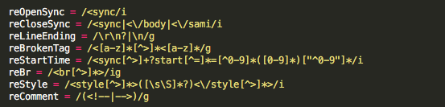
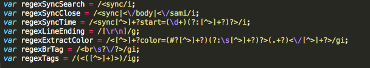
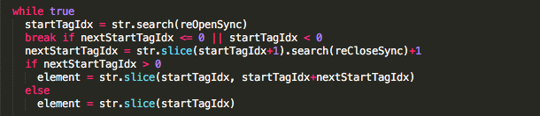
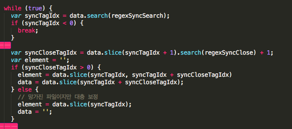

한국에서는 자막으로 주로 SMI 파일을 사용한다. 이 [포맷](https://en.wikipedia.org/wiki/SAMI)은 MS 가 만들었고 한국에서는 자주 쓰이지만 전세계적으로 봤을 때는 많이 쓰이지 않는다. 대신 SRT 파일이 많이 사용된다. 그래서 외산 플레이어들이나 디바이스들은 잘 지원하지 않는다. 윈도우 계열에서 손을 뗀지가 벌써 10여년이라, 영상을 즐길 때 SMI 파일들은 항상 스트레스였다.

그래서 만든 프로젝트가 [Sami-paser](http://npmjs.com/sami-parser) 였다. 일단, SMI 파일들을 제대로 파싱할 수 있다면, 그 다음의 변환 등은 쉽게 할 수 있기 때문에 후에 필요하면 스스로 변환기를 만들거나 누군가는 만들어낼 수 있기 때문이다. 사실 변환기를 제작하다 호구지책이 앞서고 언제나 새로운 것에 먼저 눈을 돌리는 MBTI 발명가형이다보니 진득하게 큰 그림을 완성하지 못했다. 이후 미드 볼 시간이 없기도 했고.

오랜만에 또 그 오래된 스트레스를 받았다. SMI 파일은 가지고 있는데 SRT 파일로의 변환이 필요한 상황. 새로 등장한 프로젝트를 살펴보다 평범한 주말 저녁의 기분이 망가졌다.

[sami.js](https://www.npmjs.com/package/sami.js) 라는 프로젝트의 개발자가 내 프로젝트의 코드가 “쓸데 없는 것이 많다”며 “한시간만에 잘 뽑”힌 프로젝트를 제작했다. [\[원글\]](https://redpumpkin.net/2016/02/25/smi-sami-%EC%9E%90%EB%A7%89-%ED%8C%8C%EC%84%9C/)

내 기억에 sami-parser 는 꽤 공을 들여 만들었다. 처음으로 NPM 에 공개한 프로젝트 이기도 하고, 인터넷에 도는 SMI 파일들의 문법들이 비정상인 경우가 너무 많다. 한마디로 개판이다. 이 문제를 해결하려고 모 자료실에서 100개 넘는 파일을 다운받아 테스트케이스로 만들어 돌리고 코드와 테스트 케이스에 반영했다. 물론 수집하고 돌려보는데도 1시간 이상이 든다. 그런데 한시간만에 만들어 냈다니.

그래서 코드를 보니 베껴졌다는 인상이 강하다.

Sami-parser 의 정규식sami.js 의 정규식 Sami-parser 의 Sync 태그별 분류sami.js 의 Sync 태그별 분류

그리고 한시간 만에 만들 실력자라기엔 기본적인 코드리뷰에 잡힐 것이 많이 보인다. while 내에 var 라던지.

사실 한가지 언어로 제작된 정상적인 자막만 입력받을 것 이라면, 에러처리와 다중언어 지원은 부차적인 일일 수 있다. 하지만 말 그대로 파서는, Syntax Tree 를 만들고, 정상적으로 파싱되지 않을 때 그 이유를 정확히 알려줘야 하기 때문에 자막 제작기가 자주 실수하는 에러에 대한 에러코드나, SAMI 포맷이 지원하는 다국어를 지원하고자 노력했다. 하지만 이 부분이 “쓸 데 없는 코드”로 폄하되었다.

처음 만든 프로젝트라 과욕이 있었고, 그래서 2년이나 지금 다시 본 프로젝트는 Debug Mode 정도가 있으면 코드가 훨씬 더 간결했을 것이라는 생각이 든다. 그래서 쓸데 없는 코드라는 말은 받아들일 수 있다.

그러나 프로젝트에 대한 피드백은 프로젝트 홈에서 해야한다. 코드 베껴 놓고 나는 한시간 만에 만들었다(만들었다?)고 자랑하는 것 외에 다른 인상을 나는 받지 못했다. 정확한 내 감정은 비웃음 당했다 생각한다.

가끔 왜 그렇게 만들었는지 이해 없이 “복잡하게 만들어서” “기능이 없어서” “그 코드는 안돼서” 새로 만들어 제끼는 사람이 있다. 심지어 유명 오픈 소스 프로젝트에다 대고도 “복잡한 그걸 왜 도입하느냐” 는 식이다.

그런 사람들은 기존 만들어진 프로젝트를 다시만들 때는 정치를, 유명 프로젝트 도입에 대고는 난 공부안합니다라는 자랑을 서슴지 않는다.

이 글은 원 글에 트랙백이 걸릴 것이다.