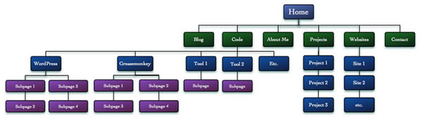
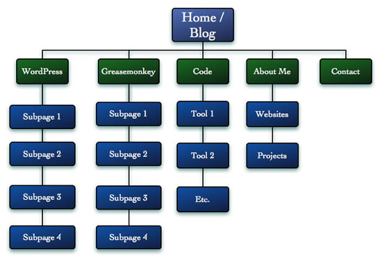
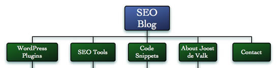
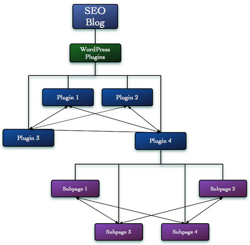

원문: [Intelligent site structure for better SEO!](http://dev.opera.com/articles/view/intelligent-site-structure-for-better-se/)

검색엔진은 오늘날 사이트에 방문자를 이끌어주는 가장 중요한 방법 중 하나이다. 따라서 검색엔진 최적화(Search Engine Optimization)은 매우 중요하다. 하지만 SEO는 종종 기술적 꼼수 모음으로 오해받곤 한다. – SEO전문가로서 고객들과 기술적인 이슈를 고치는 데에 많은 시간을 들였음을 고백한다. – 사이트의 구조는 검색엔진이 사이트의 주제가 무엇인지, 그리고 얼마나 쉽게 사이트의 목적과 의도에 맞는 컨텐츠를 찾고 색인화 할 수 있는지를 결정한다.

좋은 구조를 만듦으로써 다른 사람들로부터 링크를 받은 여러분의 컨텐츠를 활용할 수 있고, 사이트의 구조를 이른바 “링크주스(linkjuice)”와 같이 여러분 사이트의 다른 페이지에 배치해 놓을 수도 있다.

상업적인 사이트라면 질 좋은 컨텐츠를 여러분의 판매 페이지의 랭킹을 높이는데 사용할 수도 있다. 왜 필요한지 이제 관심이 좀 생겼을까? 지금까지 무엇을 왜 할지 알았으니 이제는 어떻게 하는지 알아볼 차례다. 

좋은 사이트 구조 만들기
-------------

새로운 사이트를 개발하거나 개편할 때, Visio나 하다못해 엑셀에 집어넣더라도 사이트의 구조를 그려보는 것이 도움이 된다. 여러분이 할 것은 그림 1과 같이 모든 페이지와 섹션을 트리로 만들어내는 것이다. (저자의 옛 사이트 구조에 기초함):

그림 1: 전형적인 사이트 구조

Code섹션이 전체 사이트의 반이상으로, 현재 균형이 맞지 않음을 볼 수 있다. 사이트 구조를 합리적이고 균형잡힌 피라미드 모양으로 만들어내야 한다. 사이트 내의 컨텐츠 양에 따라 2개에서 7개 사이의 메인섹션으로 구성하고 다른 섹션 대비 2배 이상 큰 섹션이 있으면 안된다.

또 다른 몇몇 포인트들이 있다. 먼저, “About Me”, “Projects”, “Websites”와 같은 기본적인 자기 소개 페이지가 3개나 있다. 또한, 내 사이트의 통계를 검토해보니 3레벨과 4레벨에 있는 Word Press 페이지가 사이트 트래픽의 30% 가량을 차지하고 있음을 알았다.

Visio나 OmniGraffle 과 같은 툴의 이점은 재정렬을 매우 쉽게 해주고, 새로운 구조가 잘 작동할 것인지 좋은 느낌을 받을 수 있게한다는 것이다. 나는 가끔 책상이나 벽에 포스트 잇을 붙여놓고 사용하기도 하는데, 둘다 나에게는 잘 맞는다.

그림 2는 재정렬한 결과이다.

그림 2: 개선된 섹션 구조

그림에서 보듯 몇몇 페이지는 트리의 상단으로 이동시켰고, 또 몇몇 페이지는 제거했다. 사이트 구조를 다시 생각하다보면 어떤 페이지들은 사용자들에게 별로 이롭지 않은 것을 자주 발견하게 될 것이다. 그런 경우에는 없애는 것이 최선이다.

또 블로그를 홈으로 옮기기로 결정했다. 내 홈페이지에는 터무니없는 이야기도 많고, 그리고 또 본질적으로는 또 다른 “About Me” 페이지의 하나이다. 나 자신에 대해 부끄러운건 아니지만 블로그가 내 사이트의 방문목적이 되는 것을 원치는 않는다. 내 블로그는 내 사이트의 토대이므로 블로그도 이 구조의 중요한 위치에 배치했다.

섹션에 이름 짓기
---------

사이트 구조에 만족했다면 섹션의 이름들에 대해 생각해 볼 차례다. 만약 섹션을 구성할 수 있을만큼 각 주제의 컨텐츠의 양이 충분하다면, 그만큼 많은 사람들도 검색을 통해 찾아올 것이라고 확신할 것이다. 이것이 바로 섹션의 이름을 사람들이 검색어로 활용하는 키워드로 만들어야 하는 이유가 되는 것이다!

예를 들어, 여러분이 나처럼 워드프레스 플러그인을 만들고 다른 사람들을 위해 섹션을 만들었다고 해보자. 이 섹션의 이름이 “워드프레스” 여서는 안된다. 여러분은 어떻게 검색할 것인가? “워드프레스 플러그인”으로 검색하지 않을까? 그러므로 “워드프레스 플러그인”과 같은 이름을 지어야 한다(이것은 “워드프레스”라고 부르지 말라는 의미가 아니고, 페이지 타이틀과 네비게이션 링크를 “워드프레스 플러그인”으로 만들라는 의미이다). 사람들이 어떤 검색어로 검색하는지를 알고자 한다면 아래 도구 들이 도움이 될 것이다.

-   [Google Trends](http://www.google.com/trends)
-   [The Google AdWords Keyword tool](https://adwords.google.com/select/KeywordToolExternal)
-   [Microsoft’s Keyword Group Detection](http://adlab.msn.com/contextSim/Default.aspx)

섹션과 하위 섹션에 알맞은 이름을 결정한다. 이제 반 정도왔다. 이제 같은 방법으로 각 페이지들의 이름을 짧고 간결하게 결정한다. 내 섹션들은 이제 그림 3과 같은 이름을 가지게 되었다.

그림 3: 알아보기 쉬운 섹션이름을 가진 사이트 구조

지금까지 우리는 사이트 구조 정의에 가장 중요한 두가지를 해왔다. 앞으로는 또 다른 몇몇 중요한 포인트에 대해 생각해보고자 한다.

숙지해야 할 몇가지 사항들
--------------

다음은 사이트 구조를 결정할 때 숙지해야 할 몇가지 사항들이다.

### 포럼과 같이 사용자가 조정하는 컨텐츠

만약 사이트의 한 부분이 다른 부분보다 훨씬 더 많은 컨텐츠가 있고, 더 많이 생산 되는 곳의 질은 상대적으로 떨어진다면, 아마도 두 곳을 섞는 것이 꺼려질 것이다. 예를 들어, “A List Apart”의 같은 초기화면을 생각해보면, 몇 주마다 아주 양질의 글들이 업데이트되고 이 글들은 다른 사이트들에 많이 링크된다. 또 다른 섹션은 포럼이다. 포럼은 그 질이 보장되지 않는 글들이 매일 몇개씩 올라오는 곳이다.

여러분의 포럼은 아마도 사이트 첫페이지의 검색 순위를 떨어뜨릴 것이다. 왜냐하면 사이트의 ranking strength 가 양질의 컨텐츠에서 포럼으로 흘러가기 때문이다. 따라서 이 둘을 함께 유지하기 위해서는 포럼을 사이트의 서브도메인으로 옮기도록 하라.

여러분이 운영하는 블로그는 상대적으로 문제가 되지 않는다. 블로그의 글들은 상대적으로 질이 보장되어 있고 여러분은 블로그 글 또한 검색 순위에 오르는 것을 바랄 것이기 때문이다.

### 중복된 카테고리와 태그

여러 카테고리를 갖는 사이트나 블로그가 빠지기 쉬운 함정은 특정 글들에 대해 지속적으로 비슷한 두 개의 카테고리를 배정하는 것이다. 예를 들어 사이트에 “브라우저”와 “오페라”라는 카테고리가 있다고 하고, 여러분은 오페라에 대해서만 글을 작성한다고 하자. 이제 브라우저 카테고리의 리스트를 보게되면 아마도 오페라 카테고리의 페이지들과 완전히 같은 컨텐츠가 존재하게 된다. 이 두가지는 기본적으로 중복이다.

태그를 사용하면 이 문제는 더 자주 일어나게 된다. 아마도 “이것이 왜 문제가 되나요?” 하고 놀라게 될텐데, 몇몇 사용자가 컨텐츠가 너무 마음에 들어 모든 포스트를 링크하려고 한다고 해보자. 이제 여러분은 그들이 어떤 카테고리의 것들을 링크하게 되는지 통제할 수 없게 된다. 어떤 사람은 “브라우저” 카테고리를 링크하고, 또 어떤 사람은 “오페라” 카테고리를 링크한다. 이런 일이 여러 번 일어나게 되면, 여러분은 good link를 던져버리는 꼴이 된다.

만약 2개의 링크가 “브라우저”카테고리로 연결되고, 2개의 링크는 “오페라” 카테고리 페이지로 연결된다고 해보자. 인기가 덜한 경쟁자의 사이트에는 “오페라”카테고리가 없고 한 개의 “브라우저”카테고리에 3개의 링크를 가지고 있다. 모든 상황이 같다고 단순가정하면 경쟁자가 당신보다 상위에 랭크되게 된다.

내부 링크 구조
--------

구조를 잘 만들었다면, 피라미드처럼 보여야 한다. 이제 이 피라미드 사이에서 어떻게 연결할 것인지를 결정해야한다. 섹션들을 큰 미라미드 내의 작은 피라미드처럼 생각해보자. 각 미라미드의 꼭대기는 그 서브페이지들과 모두 연결되어야 하고, 서브페이지들도 꼭대기와 연결되어야 한다.

컨텐츠 관점에서 각 페이지들이 긴밀히 연결되어 있으므로, 사이트가 검색에 걸리게 될 확률이 높아진다. 여러분은 검색엔진에게 어떤 것이 관련되어 있고 어떤것이 연관되지 않는지를 알려주게 된다.

그림 4를 보자.

그림 4: 각 섹션 내에서 페이지들을 서로 어떻게 연결해야할지 고려해야 한다.

각 페이지가 잘 연관되어 링크되도록 해야한다. 예를 들어, 서브페이지 3이 플러그인 2를 항상 링크하고 있다면, 사실은 플러그인 4와 연관됨에도 불구하고 검색엔진은 서브페이지 3이 플러그인 2와 연관되어있다고 여길 것이다.

새로운 사이트구조에서의 URL
----------------

새로운 사이트 구조를 만들어냈으면, 이제 다음단계로 이 구조에 맞는 URL을 만들어야 한다. 각 페이지의 URL은 그 페이지의 컨텐츠를 나타내야 한다. 어떤 키워드로 노출 될지를 결정했다면, 가장 중요한 한 개의 키워드를 URL에 포함시켜야 한다.

새 URL을 결정할 때 기억해야할 것들은

-   여러 단어는 하이픈(-)으로 분리하라.
-   Unix나 Lunux서버는 대소문자를 구분하기 때문에 대소문자를 섞으면 절대 안된다. 대소문자가 섞인 URL은 오타의 가능성을 엄청나게 높인다 – /LoOks/LiKe/ThiS/ 와 같은 URL을 잘 기억할 수 있을까?
-   숫자는 여러분의 CMS에게나 쉽지 사용자에게는 어렵다. 숫자가 섞인 URL은 사람에게는 어렵기 때문에 기억하거나 링크될 확률을 줄인다. – 숫자를 사용하지 마라.
-   될 수 있으면 URL은 추정하기 쉽게 만들어라. 사람들에게 기억되기 좋은 URL은 그들이 친구들과 이것에 관해 이야기하기도 쉽게 만든다.
-   301 Redirect를 통해 이전 페이지에서 새 페이지로 리디렉트 시켜라. 301 Redirect는 완전한 이동을 뜻하고, 검색엔진은 이전 링크 값을 새로운 페이지로 대치시킬 것이다.
-   컨텐츠가 한 URL에만 있도록 하라. 예를 들어 프린트 스타일시트를 사용한다고 하면 인쇄를 위해 또 다른 페이지를 가져야 할 아무런 이유가 없다.

주소와 관련한 정보나 일어날 수 있는 문제에 대해 더 알고 싶으면 저자의 [중복된 컨텐츠](http://yoast.com/articles/duplicate-content/)라는 글을 참고 한다.

결론 : 여러분의 사이트 구조에 적용하기
----------------------

좋은 사이트 구조는 검색엔진 최적화에 꼭 필요하다. 이는 사용자와 서치엔진 모두에게 사이트 내의 컨텐츠를 찾기 쉽게 한다. 좋은 구조는 카테고리가 잘 나뉘어 있고, 카테고리 내의 페이지들이 같은 주제끼리만 연결되는 것을 의미한다.

올바른 URL을 사용하는 것은 사용자들이 기억하고 링크하는 기회를 늘리고, 서치엔진에서 상위에 랭크될 가능성도 매우 높인다.

참고 : 나는 이 글을 2007년 10월 [dev.opera.com](http://dev.opera.com)에 기고했다. 이 주제에 대한 글이 필요하다는 결론을 내렸을 때, 오래 전 작성했던 이 글을 발견했다. 몇몇 참고링크를 더했을 뿐 중요하게 변경된 것은 없다.