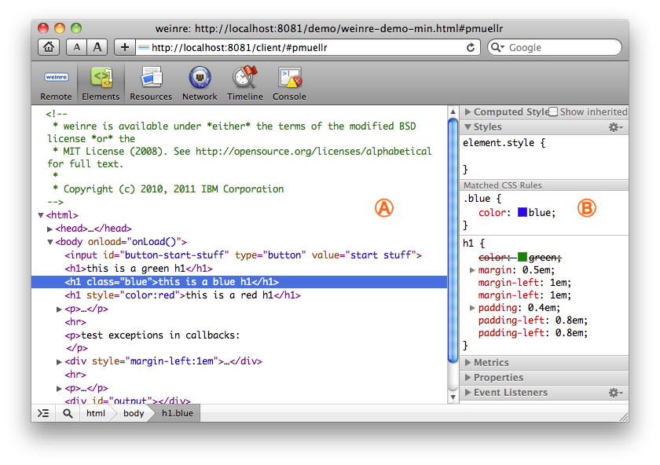
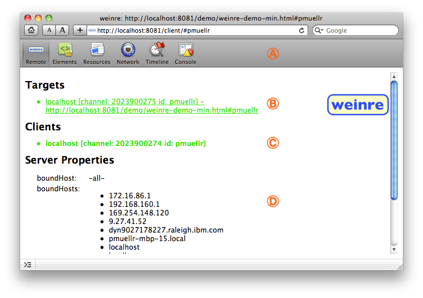

국내 모바일 브라우저 시장 점유율은 2011년 12월 현재 Webkit 계열이 99% 이상의 점유율을 가지고 있다(Statcounter 기준, Android, iPhone, iPod Touch, Dolfin 을 합한 수치).

하지만 Webkit 계열의 브라우저로 천하통일되었더라도 모바일 사이트를 구축하는 것은 여전히 쉽지 않은 일이다.

단말기가 다양할 뿐 아니라 단말기마다 사용된 웹킷 브라우저 버전이 각각 다르고, 단말기에 적용된 OS 버전에 따라서도 다르다. 심지어는 제조사의 커스터마이징이 이루어진 경우도 심심치 않게 볼 수 있다. 같은 회사에서 나온 라인업(갤럭시 S, 갤럭시 K 등) 에서도 다르게 동작하는 경우마저 있다. 

일반적인 모바일 사이트를 개발은 사파리, 크롬과 같은 PC용 웹킷 브라우저에서 이루어지고, 이후 모바일 브라우저에서 확인과정을 거치는 경우가 많다.

하지만 모바일 브라우저에서 명백히 잘못된 작동을 하는 경우에도 Firebug나 Web Inspector 등 디버깅 툴을 내장하고 있지 않으므로 정상 동작하는 코드로 되돌려내는 것은 결국 삽질을 통할 수 밖에 없다. Developer Toolbar가 지원되지 않는 IE6 대응 사이트를 만드는 것과 별반 다르지 않다.

Weinre 는 내장 디버깅 툴이 없는 모바일 브라우저를 위한 원격 디버깅 툴이다. Webkit 계열의 개발자 도구인 Web Inspector 를 사용할 수 있도록 해준다.

모바일에서도 위와 같은 디버깅이 가능해진다!

Weinre 개요
---------

처음보면 어떻게 발음해야할지 갸우뚱한 이 프로그램은 포도주 양조장이라는 ‘와이너리’라 부른다. Patrick Mueller http://muellerware.org/ 가 만든 이 프로젝트는 웹킷의 원격 디버깅 프로토콜 http://www.webkit.org/blog/1620/webkit-remote-debugging/ 을 이용해 개발되었고 하이브리드 앱 개발 도구인 Apache Callback(Phonegap) 의 서브 프로젝트이다.

Weinre를 통한 디버깅은 세가지 파트로 나뉜다.

-   서버(Server)
-   java기반(Jetty)의 http 서버이다.
    
-   대상(Target)
    
-   디버깅할 모바일 디바이스 브라우저. 웹킷 계열만 지원한다.
    
-   클라이언트(Client)
    
-   Safari, Chrome 등에 내장된 Web Inspector와 비슷한 외관의 클라이언트 페이지. -webkit- prefix 를 통한 CSS3만 지원하므로 웹킷 브라우저가 필수.
    

설치 방법
-----

### 서버

서버는 프로젝트 홈페이지에서 jar 파일을 다운로드 받아 실행한다.

`$ java -jar weinre.jar`

#### 옵션설명

`--help (or -? or -h)`

이 도움말 화면을 보여줌.

`--httpPort [포트번호]`

HTTP 서버가 동작할 포트 번호.

기본값 : 8080

`--boundHost [hostname | ip address | -all-]`

서버에 바인딩할 아이피 주소

기본값 : localhost

기본값인 localhost 로는 다른 기기에서 접속할 수 없다. 따라서 다른 기기에서 접속하기 위해서는 다른 호스트네임이나 IP 주소를 바인딩해야한다. -all- 을 사용하면 이 기기로 연결가능한 모든 인터페이스를 사용할 수 있다.

맥이나 라눅스에서는 ifconfig 을 사용하고, 윈도우에서는 ipconfig 를 사용해 ip 주소를 얻어올 수 있다.

`--verbose [true | false]`

stdout 을 통해 소소한 것까지 출력함. 

기본값: false

`--reuseAddr [true | false]`

Jetty 의 reuseAddr 옵션을 설정함. 

기본값: false

 서버를 주기적으로 재시작할 때 필요할 수 있다.

`--readTimeout [seconds]`

기본값: 5 

`--deathTimeout [seconds]`

기본값: 3 \* readTimeout

### 대상

대상은 디버깅용 JS파일을 임포트 한다. 이 디버깅용 파일은 HTML 소스에 고정적으로 로드하거나, 북마클릿을 통해 동적으로 로드할 수 있다.

``

-   여기서 a.b.c:8080 은 설치된 서버의 아이피/도메인을 의미함.

### 클라이언트

이제 사용할 준비가 완료 되었다. 브라우저를 통해 http://a.b.c:8080/client 에 접속하면 아래와 같은 Web Inspector를 볼 수 있다. 

 

활용
--

### 아이디를 이용한 여러 프로젝트 분기

스크립트 URL : http://a.b.c:8080/target/target-script-min.js#anonymous

클라이언트 접속 URL: http://a.b.c:8080/client/#anonymous

에서 마지막의 #anonymous 부분을 변경해 서버 하나에 프로젝트마다 또는 각 사용자마다 아이디를 줄 수 있다.

### 북마클릿의 활용

특히 긴급한 상황에서 북마클릿을 활용해 스크립트를 로딩하면 디버그가 가능하다.