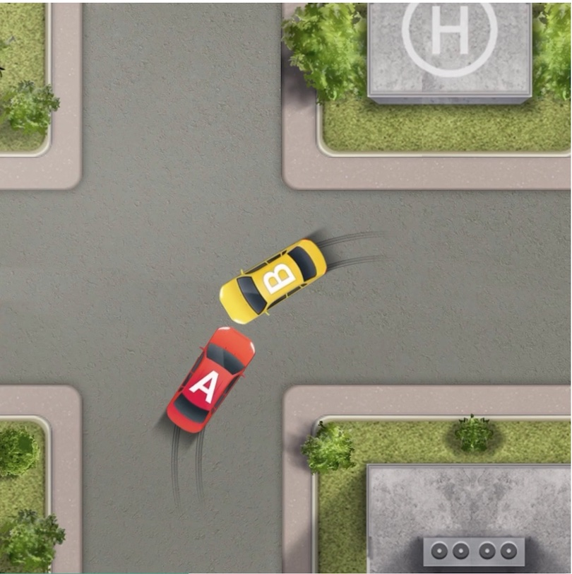
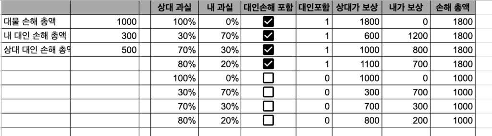

최근에 교통사고가 발생했습니다.  
교차로에서 발생한 사고인데요, 작은 도로에서 우회전으로 나가려는 중이었고, 상대는 큰 도로에서 좌회전으로 제가 있던 도로로 들어오려는 상황에 두 차의 정면의 구석부분이 부딪쳤습니다. 동네에서 벌어진, 작은 사고 였습니다.

찾아보니 비슷한 상황은 비정형으로 분류되어 있습니다. [https://accident.knia.or.kr/special-content?chartNo=C6](https://accident.knia.or.kr/special-content?chartNo=C6)

<figure></figure>

과실 비율을 따지는 일은 서로 의견이 다른 상황입니다.  
저는 제가 먼저 들어와 있는 상황에 중앙선을 물고 들어왔으니 중앙선 침범 또는 교차로 통행방법 위반, 전방주의 소홀, 교차로에서 서행 또는 일시정지 위반 등을 들어 상대 100%를 주장하고 있습니다. 상대는 대로에서 운행중인 차와 소로에서 운행중인 차가 부딪친 상황이니 저에게 과실이 크다고 주장하는 상황입니다. 따라서 이 사건은 분쟁심의위원회(자동차사고 과실비율 분쟁심의위원회, [https://accident.knia.or.kr/](https://accident.knia.or.kr/)) 에 판단을 구하려고 합니다.

교통사고 합의시에 과실 비율에 따른 대물보상과 대인손해보상의 룰이 조금 복잡하여 다음과 같은 시트를 작성했습니다. 필요하시다면 복제해서 사용하시면 되겠습니다.

<figure></figure>

이 시트에 적용된 룰은 다음과 같습니다.

1.  대물보상은 서로의 총 대물손해를 합하여 과실비율로 나눈다.
2.  대인보상 부분은 합의하에 각자 또는 서로 처리할 수 있다. (시트 내 체크박스)
3.  대인보상을 서로 처리하기로 동의한 경우 과실이 100%인 사람은 모든 대인보상을 담당한다. 과실 100%가 아니라면 서로 다른 사람의 대인손해에 대해 100% 보상한다.

참고로 2023년에는 경상이라면 각자의 대인보상은 과실비율대로 나뉜다([https://www.fnnews.com/news/202109301020597876](https://www.fnnews.com/news/202109301020597876)) 고 하니 미래에서 오신 분들은 이 시트를 그대로 사용하시면 안됩니다.

[https://docs.google.com/spreadsheets/d/1utMv-gbjnaxlaWVwtJfjEZdtioNQUxkp63vH1GnQVhc/edit#gid=0](https://docs.google.com/spreadsheets/d/1utMv-gbjnaxlaWVwtJfjEZdtioNQUxkp63vH1GnQVhc/edit#gid=0)